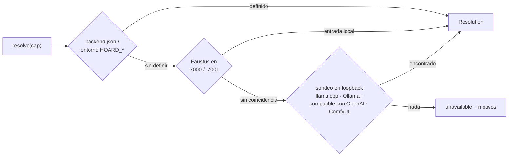
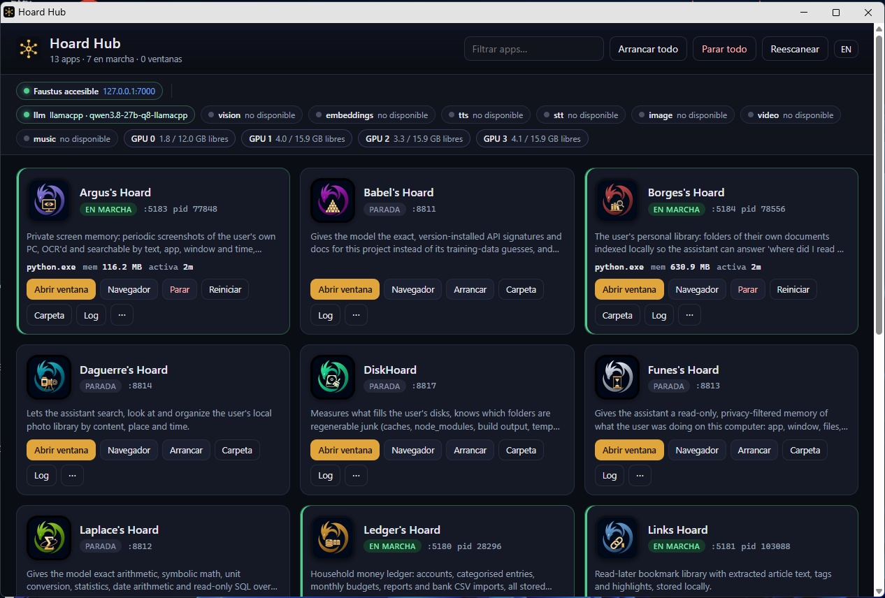

# Hoard Link

### Una sola respuesta compartida a "¿qué servidor de modelo uso ahora mismo?"

**El backend de modelos compartido para aplicaciones controladas por
agentes: elige el servidor local que ya está cargado para una capacidad
en vez de cargar una segunda copia de un modelo.**

[English](README.md) · [Primeros pasos](#primeros-pasos) ·
[Hoard Hub](#hoard-hub-el-lanzador-de-escritorio) · [Uso con Faustus](#uso-con-faustus) · [API](#api) ·
[Portfolio](https://luissalet.github.io/Portfolio/#projects)

Hoard Link es una librería de Python pequeña — solo librería estándar más
`httpx`, sin servidor, sin puerto, sin interfaz — que un conjunto de
aplicaciones locales pueden incluir (cada una con su propia copia) para
responder a una sola pregunta: **para la capacidad X (`llm`, `vision`,
`embeddings`, `tts`, `stt`, `image`, `video`, `music`), ¿qué servidor y qué
modelo uso ahora mismo, y por qué?** — y después hacer la llamada de verdad.

## Por qué importa compartir en una máquina limitada por GPU

En una máquina que ejecuta **Faustus** (un espacio de trabajo de IA local)
más varias aplicaciones plugin, la GPU es el recurso escaso. Un caso
realista es un `llama-server` (llama.cpp) sirviendo un modelo de 27B que
por sí solo ocupa la mayor parte de una GPU grande, a veces con Ollama y
ComfyUI al lado. Si cada aplicación que quisiera hacer una
llamada a un LLM cargara su *propio* modelo, la máquina se quedaría sin
VRAM al arrancar la segunda aplicación. El trabajo de Hoard Link es hacer
que cada aplicación pregunte "¿alguien ya está sirviendo lo que
necesito?" antes de pedirle a un servidor que cargue nada, y no molestar
nunca la conversación que la persona esté teniendo con Faustus en ese
momento.

Hoard Link no ejecuta su propio servidor de modelos ni gestiona ciclos de
vida. Resuelve una dirección y — para chat/embeddings/tts — hace la
llamada HTTP por ti contra el servidor que ha encontrado.

## Primeros pasos

Windows (PowerShell):

```powershell
git clone https://github.com/Luissalet/HoardLink.git
cd HoardLink
py -m venv .venv
.venv\Scripts\Activate.ps1
pip install -e ".[dev]"
python examples/status.py
```

Linux / macOS:

```bash
git clone https://github.com/Luissalet/HoardLink.git
cd HoardLink
python3 -m venv .venv
. .venv/bin/activate
pip install -e ".[dev]"
python examples/status.py
```

`examples/status.py` imprime una línea por capacidad: qué se ha resuelto
y por qué, o por qué no se ha resuelto nada. En una máquina sin ningún
servidor de modelos en marcha todas las líneas dicen `unavailable`
seguido de los motivos (en inglés, tal como los devuelve la librería):

```
hoard-link 0.1.1
       llm  unavailable  Faustus not reachable on configured/default ports; no llama.cpp server found on ports 8080-8090; Ollama not reachable on 11434; no OpenAI-compatible server found on 1234
```

Arranca `llama-server`, Ollama o ComfyUI (o apunta `HOARD_LLM_URL` a un
servidor) y vuelve a ejecutarlo para ver cómo se resuelve esa capacidad.
Pasa la ruta de un `backend.json` como primer argumento para probar tu
propia configuración.

## Orden de resolución

Para cada capacidad, en este orden:



1. **Configuración explícita** — el `backend.json` propio de la
   aplicación y las variables de entorno `HOARD_<CAP>_URL` /
   `HOARD_<CAP>_MODEL` / `HOARD_FAUSTUS_URL` / `HOARD_FAUSTUS_TOKEN` /
   `HOARD_COMFY_URL`. Una capacidad con `url` (o `command`) gana sin más
   y no se comprueba; una dirección caducada aparece como `BackendError`
   (status `0`: sin respuesta HTTP) la primera vez que se usa de verdad.
   Un `model` sin `url` es solo una *preferencia*, que se aplica allí
   donde los pasos siguientes tienen donde elegir (modelos residentes de
   Ollama, la lista de modelos de Faustus, la lista de un servidor
   compatible con OpenAI).
2. **Faustus** — si una instancia de Faustus responde `GET /api/health`
   como saludable en `127.0.0.1:7000` o `:7001` (configurable), Hoard Link
   lee `GET /api/models` (con un token si hay uno configurado) para
   obtener el registro de servidores de modelos que usa el propio
   Faustus, y habla con ese servidor **directamente** — el mismo
   servidor, el mismo modelo residente, que es la forma real de
   compartir. Solo se usan entradas locales (categoría `local`, URL de
   loopback): un endpoint en la nube del registro de Faustus se ignora
   para que los datos de la aplicación nunca salgan de la máquina. Una
   entrada de Ollama se contrasta con el `/api/ps` de ese Ollama antes de
   declararla residente. Sin token configurado la petición va sin él (un
   Faustus con la autenticación desactivada responde igual); un 401
   entonces indica que hace falta un token. Para `tts`/`stt` también prueba los propios
   `/api/tts/*`/`/api/stt/*` de Faustus; un 401/403 ahí se registra como
   motivo (una sesión solo de navegador) y la resolución sigue adelante
   en vez de fallar.
3. **Servidores compartidos en loopback**, sondeados en paralelo con un
   tiempo límite real de 1 s por petición y guardados en caché 30 s (sin
   duplicados: las resoluciones simultáneas comparten un mismo sondeo; el
   cliente de
   sondeo ignora `HTTP(S)_PROXY`): llama.cpp (`8080`–`8090`, vía
   `/props`, `/v1/models`, `/slots`), Ollama (`11434`, vía `/api/ps` para
   modelos **residentes**, `/api/tags`, `/api/show` para capacidades), un
   servidor de chat genérico compatible con OpenAI en el puerto `1234` (solo
   `llm`), y ComfyUI (`8188`, `image`/`video`). Un puerto solo cuenta como
   llama-server si su `/props` trae claves de llama-server. Ningún sondeo
   lanza nunca una excepción, responda el puerto con el JSON que sea.
4. **Nada** — la capacidad vuelve como `unavailable`, con la lista de
   motivos recogidos por el camino (por qué Faustus no respondió, por qué
   ningún servidor en loopback encajaba, etc.) para que la pantalla de
   Ajustes de una aplicación pueda mostrarle a una persona exactamente qué
   arreglar.

## Políticas

- **`only_resident = True` por defecto.** Hoard Link elige modelos que ya
  están cargados — `/api/ps` de Ollama, o un llama-server, que siempre
  sirve exactamente el único modelo con el que se arrancó. No le pedirá a
  un servidor que cargue un modelo distinto salvo que la configuración de
  la aplicación ponga `allow_load: true` para esa capacidad (u
  `only_resident: false` en general), y nunca envía `keep_alive`. Un
  modelo que habría que cargar se comprueba igualmente (`/api/show`) para
  la capacidad pedida, y un modelo solo de embeddings nunca se elige para
  `llm`.
- **Cede el paso al primer plano.** `await link.wait_idle("llm",
  max_wait_s=30)` es `True` de inmediato cuando el llama-server resuelto
  no tiene ningún slot con `is_processing`, y si no, sondea cada 2s hasta
  que lo esté o hasta que pasen `max_wait_s` (entonces `False`, y quien
  llama decide posponer su trabajo en segundo plano). Funciona venga el
  llama-server del sondeo, del registro de Faustus o de la configuración
  explícita (`provider: "llamacpp"`). Ollama no expone
  ninguna señal de ocupado, así que `wait_idle` devuelve siempre `True`
  para él — documentado aquí en vez de dejarlo a adivinar.
- **Los trabajos de GPU conocen la VRAM libre antes.** `gpu_free_mb()`
  ejecuta `nvidia-smi --query-gpu=index,memory.total,memory.used
  --format=csv,noheader,nounits` (en la medida de lo posible: sin GPU NVIDIA o sin
  `nvidia-smi` en el PATH simplemente da `[]`; en Windows se ejecuta con
  `CREATE_NO_WINDOW` y también busca en la carpeta antigua `NVSMI`).
  `resolve("image")` lo ejecuta en un hilo aparte e informa de la GPU con
  más memoria libre y de una lista por GPU. `ComfyClient` nunca llama
  a `/free` por su cuenta; solo cuando quien llama lo pide.
- **Cada resolución se explica sola.** `Resolution.reason` es una frase
  apta para una pantalla de Ajustes, p. ej. `"llm -> llama.cpp at
  127.0.0.1:8081 (qwen3.8-27b-q8-llamacpp), from Faustus registry;
  resident"`.

## Instalación (copia en la aplicación)

Hoard Link está pensado para ser **copiado**, no instalado como
dependencia de terceros, para que cada aplicación lleve en su propio
repositorio una copia versionada del comportamiento exacto contra el que
se escribieron sus tests. Copia el directorio `hoard_link/` entero (todos
los `.py`, sin `__pycache__/`) dentro de tu paquete, no edites la copia,
y para actualizar sustituye el directorio completo. Deja constancia de su
origen en un `VENDORED.txt` junto a ella:

```
<app_pkg>/
  hoard_link/        <- copia del directorio hoard_link/ de este repo
    VENDORED.txt     <- "Vendored from HoardLink (https://github.com/Luissalet/HoardLink), version 0.1.1"
  ...
```

Todas las aplicaciones que usan la misma versión llevan una copia
idéntica byte a byte, así que un arreglo llega a todas volviendo a copiar
una sola versión.

```python
from .hoard_link import Link, LinkConfig
```

Si tu aplicación ya gestiona sus propias dependencias y tiene `httpx`,
esa es la única dependencia de terceros. Python 3.11+, librería estándar +
`httpx>=0.27,<1.0`, sin código específico de plataforma — funciona igual
en Windows y en Linux.

## Esquema de `backend.json`

Todas las claves son opcionales; lo que no se fije cae al siguiente paso
(Faustus, luego el sondeo en loopback).

```json
{
  "only_resident": true,
  "faustus": {"url": "http://127.0.0.1:7000", "token": "ody_..."},
  "comfy": {"url": "http://127.0.0.1:8188"},
  "capabilities": {
    "llm": {
      "url": "http://127.0.0.1:8081/v1/chat/completions",
      "model": "qwen3.8-27b-q8-llamacpp",
      "api": "openai",
      "provider": "llamacpp",
      "allow_load": false,
      "vram_mb": 20000
    },
    "tts": {"command": ["piper", "--model", "es_ES.onnx", "--output_file", "{out}"]}
  },
  "gpu_lease": {"enabled": true, "hub_url": "http://127.0.0.1:8810", "timeout_s": 300, "vram_mb": 8192}
}
```

Variables de entorno (máxima prioridad, se aplican encima del archivo):
`HOARD_<CAP>_URL`, `HOARD_<CAP>_MODEL` (p. ej. `HOARD_LLM_URL`,
`HOARD_VISION_MODEL`), `HOARD_FAUSTUS_URL`, `HOARD_FAUSTUS_TOKEN`,
`HOARD_COMFY_URL`, `HOARD_GPU_LEASE=0` (sin reservas de GPU),
`HOARD_HUB_URL` (dónde está el hub). Una variable vacía cuenta como no
definida.

- `gpu_lease` y `vram_mb` solo cuentan cuando una llamada haría **cargar**
  un modelo al servidor (`allow_load`, o `only_resident: false`): ver
  [Reservas de memoria de GPU](#reservas-de-memoria-de-gpu). `vram_mb` en
  una capacidad es lo que necesita cargar su modelo; sin él se usa el
  tamaño del fichero del modelo de Ollama más un 20% y 512 MiB, y si no,
  `gpu_lease.vram_mb`.

- `url` puede ser la raíz del servidor (`http://127.0.0.1:8081`), una base
  `/v1` o un endpoint completo; chat y embeddings añaden cada uno la ruta
  que necesitan. Una URL bajo `/api/` implica `"api": "ollama"`; si no,
  `"openai"`.
- `command` es una lista de cadenas. `{text}`, `{voice}` y `{out}` se
  sustituyen literalmente; sin `{text}` el texto se escribe en la stdin
  del comando (así lo lee Piper), sin `{out}` el audio se lee de stdout.
  Se ejecuta sin ventana de consola y con un tiempo límite de 120 s.
- El archivo se lee como UTF-8 con o sin BOM (lo que guarda el Bloc de
  notas por defecto).

## Hoard Hub: el lanzador de escritorio



El repositorio incluye también **Hoard Hub** (`hoard_link.hub`), la otra
mitad de la misma idea: la librería responde *qué servidor de modelo uso*,
el hub responde *cuáles de mis apps están levantadas, y ábreme esa* — sin
ningún workspace de IA por medio. Es un servidor pequeño en loopback con
una tarjeta por app y su propia ventana de escritorio.

Cada app de la familia lleva un `faustus-plugin.json` en la raíz de su
repositorio (id, nombre, propósito, URL, comprobación de salud, cómo
arrancarla). El hub lee esos manifiestos directamente de las carpetas
vecinas de este repositorio (o de las raíces que configures) — no hay que
escribir nada nuevo — y para cada app enseña:

* su **icono**, nombre, propósito, puerto y **estado**: en marcha (la
  comprobación de salud contesta con el `service` esperado), arrancando
  (hay un proceso escuchando pero aún no contesta), parada, o *puerto
  ocupado* (contesta otra cosa; el hub jamás parará ese proceso);
* el **proceso** detrás del puerto: pid, ejecutable, memoria, tiempo en
  marcha, hijos (psutil);
* acciones: **Abrir ventana** (la interfaz de la app como ventana propia
  de escritorio — una ventana `--app` de Chromium con perfil por app, así
  tiene su propia entrada en la barra de tareas y se puede localizar y
  cerrar después), **Navegador**, **Arrancar** (el `launch_hint` del
  manifiesto, desacoplado, con la salida en `data/logs/<id>.log`),
  **Parar** (el árbol de procesos, solo cuando la salud confirma que quien
  escucha es de verdad esa app), **Reiniciar**, **Cerrar ventanas**,
  **Carpeta**, **Log**;
* arriba, si Faustus está accesible y qué resuelve Hoard Link ahora mismo
  para cada capacidad, más la VRAM libre por GPU;
* un panel **GPU**: por GPU la memoria usada / reservada / disponible, y
  las [reservas de VRAM](#reservas-de-memoria-de-gpu) concedidas y en
  cola, cada una con un botón Liberar.

Cerrar la ventana del hub para el hub; las apps que arrancó siguen en
marcha, a propósito — es un mando a distancia, no un padre.

```powershell
pip install psutil            # pids, memoria, parar árboles de procesos
python -m hoard_link.hub      # servidor en 127.0.0.1:8810 + ventana
python -m hoard_link.hub --no-window   # solo servidor (para un agente)
```

En Windows, doble clic en `Hoard Hub.cmd`. La configuración vive en
`data/hub.json` (`roots`, `icon_dirs`, `browser`, `faustus_dir`,
`faustus_python`, `window_size`, `exit_with_window`, `language`) o en las
variables de entorno `HOARD_HUB_*`; `pip install "hoard-link[desktop]"`
añade pywebview para una ventana nativa del hub.

### Reservas de memoria de GPU

Varios programas quieren las mismas GPUs a la vez: un llama-server con un
modelo grande repartido entre GPUs, Ollama cargando otro, varias
instancias de ComfyUI renderizando vídeo, la transcripción de voz de una
app y el embebedor de imágenes de otra. Cuando cada uno mira
`nvidia-smi` por su cuenta, dos pueden ver los mismos gigas libres en el
mismo instante, cargar los dos, y uno se queda sin memoria. El hub es el
único proceso local de larga vida al que llegan todas las apps, así que
lleva una sola cola para toda la máquina:

```python
from hoard_link import lease

with lease(vram_mb=6000, purpose="whisper large-v3", owner="scribe") as l:
    modelo = cargar_modelo(device=f"cuda:{l.gpu}" if l.gpu is not None else "cuda")
    ...                        # se renueva en segundo plano y se libera al salir

async with lease(vram_mb=20000, purpose="render de vídeo", owner="daguerre", priority=1, timeout_s=600) as l:
    ...
```

* Una petición se **concede** cuando `vram_mb` cabe en una GPU (la pedida,
  o la que más sitio tiene), contando a la vez lo que dice `nvidia-smi` y
  lo que el hub ya ha prometido a otros; si no, queda **en cola**: primero
  la mayor `priority`, luego por orden de llegada. Una petición en cola que
  no cabe retiene a las siguientes para esa misma GPU, así un render
  grande no se queda esperando para siempre detrás de cargas pequeñas.
* Por GPU: `disponible = total - max(usada, base + reservada) - margen`,
  donde `reservada` es la suma de las reservas concedidas y `base` lo que
  usaba la GPU la última vez que no tenía reservas. Dos reservas nunca se
  solapan antes de que carguen sus modelos, y un modelo ya cargado no se
  cuenta dos veces (entonces `usada` ya lo incluye). `lease_headroom_mb`
  en `hub.json` (256 por defecto) queda siempre libre en cada GPU.
* Una reserva dura `ttl_s` (1800 s por defecto) y el cliente la renueva
  mientras la tiene. La que no se renueva caduca, y la de un proceso que
  ha muerto (`pid`, comprobado con psutil) se retira, así que una app que
  se cae nunca bloquea la cola. Una petición en cola que nadie consulta en
  90 s sale de la cola. Las reservas se guardan en `data/leases.json` y
  sobreviven a un reinicio del hub.
* Entrar espera a la concesión; `timeout_s` acota la espera y lanza
  `LeaseTimeout` (la petición se retira de la cola). Una petición mayor que
  cualquier GPU elegible lanza `LeaseError`.
* **Sin hub no se rompe nada.** Si no contesta ningún hub y no se puede
  arrancar uno (el mismo arranque sin ventana que usa el puente MCP; se
  desactiva con `HOARD_HUB_AUTOSTART=0`), la reserva vuelve a la
  comprobación local de siempre: lee `gpu_free_mb()`, elige una GPU con
  sitio si la hay, deja un aviso en el log y la app sigue. `l.via` vale
  `"hub"` o `"local"`.
* El cliente encuentra el hub por `hub_url=`, `HOARD_HUB_URL`, el fichero
  `url` de `HOARD_HUB_DATA_DIR` o del `data/` del clon de HoardLink (una
  copia metida dentro de una app busca una carpeta hermana `HoardLink`), y
  si no `http://127.0.0.1:8810`.
* `Link.chat()` y `Link.embed()` piden una reserva solas cuando la llamada
  haría **cargar** un modelo al servidor (un modelo ya residente no la
  necesita), la liberan al terminar, y convierten una espera en cola más
  larga que `gpu_lease.timeout_s` en `Unavailable`. Si el hub rechaza la
  petición de plano (p. ej. una estimación mayor que una GPU, para un
  modelo que Ollama repartiría entre varias) se carga sin reserva.
* Sin GPU NVIDIA (sin `nvidia-smi`) las reservas se conceden sin mirar la
  memoria, así el mismo código funciona en cualquier máquina.

HTTP (loopback, sin token, con la misma protección cross-site que la
interfaz): `POST /api/lease/request`
`{owner, purpose, vram_mb, gpu, priority, ttl_s, wait, pid}` →
`{lease_id, state, gpu, expires_at, position}` (`wait: true` espera hasta
25 s; manda `{lease_id, wait: true}` para seguir esperando sin perder el
sitio), `POST /api/lease/renew` `{lease_id, ttl_s}`,
`POST /api/lease/release` `{lease_id}`, `GET /api/lease` (GPUs con
usada/libre/reservada/disponible, reservas y cola), `GET /api/lease/<id>`.
La ventana del hub tiene un panel **GPU** con lo mismo y un botón Liberar
por reserva.

### Controlar el hub desde un agente

El hub habla el mismo contrato que las apps que gestiona:
`GET /api/agent/tools` y `POST /api/agent/call` con el token bearer de
`data/mcp-token`, y un puente MCP por stdio (`python -m hoard_link.hub.mcp`)
que reenvía las llamadas y arranca un hub sin ventana cuando no hay
ninguno escuchando. Herramientas: `hub_list_apps`, `hub_app_status`,
`hub_start_app`, `hub_stop_app`, `hub_restart_app`, `hub_open_app`,
`hub_close_windows`, `hub_start_all`, `hub_stop_all`, `hub_backends`,
`hub_lease_status`, `hub_lease_request`, `hub_lease_release`,
`hub_rescan`. Más detalle en [docs/HUB.md](docs/HUB.md). El `faustus-plugin.json` del propio repositorio permite a
Faustus adoptar el hub como a cualquier otra app.

## Uso con Faustus

Si Faustus corre en la misma máquina con la autenticación desactivada, no
hay nada que configurar: Hoard Link lo encuentra en `127.0.0.1:7000` o
`:7001`, lee su registro de modelos y habla con los mismos servidores
locales que Faustus ya tiene cargados (ver
[Orden de resolución](#orden-de-resolución), paso 2). Para cualquier otro
puerto, pon `faustus.url` en `backend.json` (o `HOARD_FAUSTUS_URL`).

Si Faustus exige autenticación, genera un token con el scope `chat` (el que aceptan hoy el
registro de modelos y los endpoints de TTS/STT) y ponlo en el
`backend.json` de la aplicación bajo `faustus.token`, o expórtalo como
`HOARD_FAUSTUS_TOKEN` para el proceso de la aplicación. Los tokens de
Faustus tienen la forma `ody_...`; trátalos como cualquier otro secreto
local (mantenlos fuera del propio historial de git de la aplicación —
`backend.json` suele vivir bajo el `data/` de la aplicación, que está en
el `.gitignore`).

## API

```python
import os
from hoard_link import Link, LinkConfig

link = Link(LinkConfig.load(path_to_backend_json, env=os.environ, app="argus"))

res = await link.resolve("vision")   # Resolution(capability, provider, url, model, api, state, reason, details)

status = await link.status()         # dict para GET /api/backend en la aplicación: la Resolution de cada capacidad

text = await link.chat(
    [{"role": "user", "content": "..."}],
    images=[jpeg_bytes],
    max_tokens=300,
    temperature=0.2,
    capability="vision",
    response_format=None,
)                                     # -> ChatResult(text, model, provider, usage, elapsed_ms, reasoning)

vecs = await link.embed(["a", "b"])  # cuando resuelve un servidor de embeddings; si no, lanza Unavailable

wav = await link.tts("Hola", voice=None)   # TTS de Faustus o un comando configurado; si no, Unavailable

comfy = await link.comfy()           # ComfyClient, o None si no resuelve nada

idle = await link.wait_idle("llm", max_wait_s=30)   # True/False, ver Políticas arriba

link.sync.chat(...)                  # las mismas llamadas, bloqueantes, para código de aplicación síncrono

from hoard_link import lease, Lease, LeaseTimeout, LeaseError
with lease(vram_mb=6000, purpose="whisper", owner="scribe", gpu=None, priority=0,
           timeout_s=None, hub_url=None) as l:   # también `async with`
    l.gpu, l.via, l.lease_id          # índice de GPU (o None), "hub" | "local", id en el hub
```

- `api` es `"openai"` (`/v1/chat/completions`, imágenes como URLs de datos
  `image_url` en el último mensaje de usuario) u `"ollama"` (`/api/chat`,
  `images: [base64]` en el último mensaje de usuario, `stream: false`).
- El razonamiento se mantiene fuera de `ChatResult.text` y se expone en
  `ChatResult.reasoning`: bloques `<think>...</think>` cerrados, un
  `</think>` huérfano (la plantilla de chat abrió la etiqueta en el
  prompt), un `<think>` sin cerrar (cortado por `max_tokens`) y los campos
  aparte (`reasoning_content` de llama-server, `thinking` de Ollama).
- `response_format` se pasa tal cual en el dialecto OpenAI y se traduce al
  `format` de Ollama (`json_object` -> `"json"`, `json_schema` -> el
  esquema). Las imágenes llevan su tipo MIME real (JPEG, PNG, GIF, WebP).
- `ComfyClient(url)`: `system_stats()`, `object_info(node=None)`,
  `upload_image(bytes, filename, overwrite=True)`,
  `queue(workflow: dict, client_id) -> prompt_id`,
  `wait(prompt_id, timeout_s, on_progress=None)`,
  `outputs(prompt_id) -> list[OutputFile]`, `download(output) -> bytes`,
  `interrupt()`, `free(unload_models=False, free_memory=False)`.
  `queue()` valida el **formato API** (un diccionario de id de nodo ->
  `{class_type, inputs}`) y lanza un `ValueError` claro si recibe la
  exportación de la interfaz, `{"nodes": [...], "links": [...]}`. Los
  errores HTTP lanzan `BackendError` con el cuerpo de la respuesta (así
  los `node_errors` de `/prompt` llegan a quien llama), y `wait()` lanza
  `BackendError` si el trabajo terminó con un error de ejecución.
- Errores: `Unavailable(capability, reasons)` cuando no se resuelve nada,
  `BackendError(provider, status, body_excerpt)` para cualquier llamada
  fallida a un servidor resuelto: un estado que no es 2xx, una respuesta
  que no es el JSON esperado, o `status == 0` cuando no hubo respuesta
  HTTP en absoluto.
- `link.sync.*` corre en un hilo con su propio bucle de eventos y su
  propio cliente HTTP, así que una aplicación puede mezclar `await
  link.chat()` y `link.sync.chat()` en el mismo `Link`. Si inyectas tu
  propio `httpx.AsyncClient`, se comparte tal cual; no mezcles ambos
  estilos sobre él. Llamar a `link.sync.*` desde ese hilo privado (p. ej.
  dentro de un callback) lanza `RuntimeError` en vez de bloquearse.

## Límites (lo que esta librería no hace)

- **Sin generación de música.** El `object_info` de ComfyUI no da una
  señal fiable para grafos de audio/música como sí la da
  `CheckpointLoaderSimple` para checkpoints de imagen, así que `music`
  solo se resuelve mediante configuración explícita o una entrada del
  registro de Faustus que encaje, nunca mediante sondeo en loopback.
- **Sin progreso por websocket para ComfyUI.** `ComfyClient.wait()`
  sondea `/history/{id}`; no abre `/ws` para recibir el progreso en
  directo. Sondear cada segundo es sencillo, correcto y comprobable sin
  conexión; un cliente de websocket es una cosa más que mantener viva y
  reconectar, y no compensa solo para esperar a que termine un trabajo.
- **`resolve()` no verifica la configuración explícita.** La fuente 1 del
  orden de resolución se confía tal cual; una entrada caducada en
  `backend.json` aparece como un `BackendError` con `status == 0` en la
  primera llamada real, en vez de comprobarse por adelantado. Así la
  configuración explícita hace una sola cosa (tener prioridad sobre todo
  lo demás) en vez de dos.
- **La fachada síncrona es un hilo de fondo por `Link`.** Está pensada
  para una aplicación cuyos propios manejadores de peticiones son
  síncronos; no es un pool de hilos y no paraleliza llamadas al mismo
  `Link`. Llamada desde código asíncrono bloquea ese hilo hasta tener el
  resultado, así que ahí mejor `await`.
- **Sin TTS por URL HTTP.** `tts` funciona con el servicio TTS de Faustus
  o con un `command` configurado; una capacidad `tts` con solo `url` se
  resuelve pero `link.tts()` lanza `Unavailable`.
- **Sin endpoints en la nube.** Las entradas no locales del registro de
  Faustus se ignoran a propósito.

## Tests

Con el entorno virtual de [Primeros pasos](#primeros-pasos) activado, en
Windows o en Linux:

```
pytest -q
```

184 tests, sin conexión (`httpx.MockTransport`), en unos 10 segundos. Los
únicos sockets reales están en los tests de la fachada síncrona y en los
del hub, que arrancan servidores HTTP mínimos en puertos efímeros de
`127.0.0.1` (una app falsa que contesta a `/api/health` y otra que el hub
arranca y para de verdad); los tests del comando TTS usan el propio
intérprete de Python como "binario de TTS". Ningún test necesita red ni descargar un modelo, así
que la CI (`.github/workflows/ci.yml`: Ubuntu y Windows, Python 3.11 a
3.13) ejecuta la misma batería sin GPU y sin red.

## Licencia

MIT — ver [LICENSE](LICENSE).
