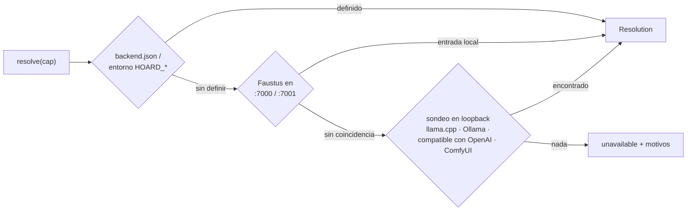
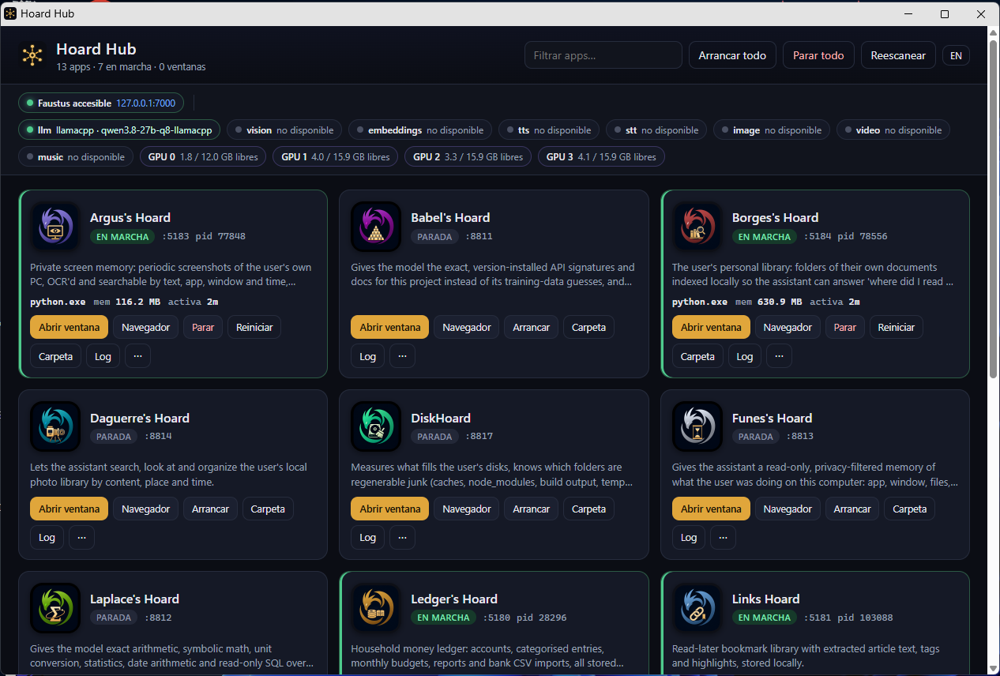

# Hoard Link

Hoard Hub descubre HomeHoard y Mercator por sus manifiestos locales y muestra
sus iconos en las fichas. Scribe se fusionó con Funes y ya no aparece como
aplicación ni como regla recomendada. Hypatia conserva su icono existente.

### Una sola respuesta compartida a "¿qué servidor de modelo uso ahora mismo?"

**El backend de modelos compartido para aplicaciones controladas por
agentes: elige el servidor local que ya está cargado para una capacidad
en vez de cargar una segunda copia de un modelo.**

[English](README.md) · [Primeros pasos](#primeros-pasos) ·
[Hoard Hub](#hoard-hub-el-lanzador-de-escritorio) · [Uso con Faustus](#uso-con-faustus) · [API](#api) ·
[Portfolio](https://luissalet.github.io/Portfolio/#projects)

Proyectos y archivos nativos compartidos mediante Atlas y Hub: [guía de espacios compartidos](docs/commons/workspace.es.md).

Los iconos se actualizan con la consulta normal del Hub, sin reiniciar, recargar la página ni escanear manualmente: [actualización de iconos](docs/HUB-ICONS.es.md).

Hoard Link es una librería de Python pequeña — solo librería estándar más
`httpx`, sin servidor, sin puerto, sin interfaz — que un conjunto de
aplicaciones locales pueden incluir (cada una con su propia copia) para
responder a una sola pregunta: **para la capacidad X (`llm`, `vision`,
`embeddings`, `tts`, `stt`, `image`, `video`, `music`), ¿qué servidor y qué
modelo uso ahora mismo, y por qué?** — y después hacer la llamada de verdad.

## Por qué importa compartir en una máquina limitada por GPU

En una máquina que ejecuta **Faustus** (un espacio de trabajo de IA local)
más varias aplicaciones plugin, la GPU es el recurso escaso. Un caso
realista es un `llama-server` (llama.cpp) sirviendo un modelo de 27B que
por sí solo ocupa la mayor parte de una GPU grande, a veces con Ollama y
ComfyUI al lado. Si cada aplicación que quisiera hacer una
llamada a un LLM cargara su *propio* modelo, la máquina se quedaría sin
VRAM al arrancar la segunda aplicación. El trabajo de Hoard Link es hacer
que cada aplicación pregunte "¿alguien ya está sirviendo lo que
necesito?" antes de pedirle a un servidor que cargue nada, y no molestar
nunca la conversación que la persona esté teniendo con Faustus en ese
momento.

Hoard Link no ejecuta su propio servidor de modelos ni gestiona ciclos de
vida. Resuelve una dirección y — para chat/embeddings/tts — hace la
llamada HTTP por ti contra el servidor que ha encontrado.

## Primeros pasos

Windows (PowerShell):

```powershell
git clone https://github.com/Luissalet/HoardLink.git
cd HoardLink
py -m venv .venv
.venv\Scripts\Activate.ps1
pip install -e ".[dev]"
python examples/status.py
```

Linux / macOS:

```bash
git clone https://github.com/Luissalet/HoardLink.git
cd HoardLink
python3 -m venv .venv
. .venv/bin/activate
pip install -e ".[dev]"
python examples/status.py
```

`examples/status.py` imprime una línea por capacidad: qué se ha resuelto
y por qué, o por qué no se ha resuelto nada. En una máquina sin ningún
servidor de modelos en marcha todas las líneas dicen `unavailable`
seguido de los motivos (en inglés, tal como los devuelve la librería):

```
hoard-link 0.1.1
       llm  unavailable  Faustus not reachable on configured/default ports; no llama.cpp server found on ports 8080-8090; Ollama not reachable on 11434; no OpenAI-compatible server found on 1234
```

Arranca `llama-server`, Ollama o ComfyUI (o apunta `HOARD_LLM_URL` a un
servidor) y vuelve a ejecutarlo para ver cómo se resuelve esa capacidad.
Pasa la ruta de un `backend.json` como primer argumento para probar tu
propia configuración.

## Novedades de la 0.7

- **Esferas.** La vida personal y la del trabajo (o del trabajo por tu cuenta) separadas: cada esfera tiene sus
  cuentas de correo, fuentes de chat, remitentes VIP, palabras clave, horas de silencio, reparto de avisos y
  resumen de la mañana. Un selector en la barra del hub (y en Faustus) cambia la activa; el correo del trabajo no
  llega a las apps personales.
- **Un solo centro de avisos.** Las apps piden al hub que te avise (`fam_notify.notify`, en JS `notify`); el hub
  elige Windows, ntfy, Telegram o correo según la prioridad y la esfera, guarda lo que llega en horas de silencio
  o repetido y lleva el historial. Las apps conservan sus canales propios como respaldo.
- **Una sola lectura del correo.** La pasarela lee las cuentas de correo de Faustus una vez para toda la familia,
  clasifica cada mensaje (esfera, prioridad, qué apps lo quieren) y cada app solo ve su parte; más las listas
  «necesita tu atención» y «sin dueño». Slack y Microsoft 365 (chats de Teams, Outlook) como fuentes de chat.
- **Hoy.** Lo que tiene fecha en cada app (plazos, entregas, cumpleaños, mantenimiento, lanzamientos,
  renovaciones, exámenes…) en una agenda, un resumen de la mañana por esfera (con unas líneas escritas por el
  modelo local si hay uno cargado) y un calendario al que suscribirse desde el móvil (`/calendar.ics`).
- **Referencias, búsqueda, trabajos y compras.** Enlaces entre registros de apps distintas, una búsqueda sobre
  todas las apps, los trabajos largos de cada app con su GPU y la vida de cada compra (pagada → enviada →
  entregada → archivada → guardada).
- **Diecisiete reglas recomendadas** que se instalan solas (y no vuelven si quitas una).

## Novedades de la 0.6

- **Rutas medidas.** Una app que hace benchmarks (Galton's Hoard) escribe
  en `~/.hoard/routes.json` qué modelo local va mejor para cada tarea, y
  `link.resolve("llm", task="code")` / `link.chat(..., task="code")` lo
  usan para ordenar los modelos que la resolución ya considera. Las rutas
  solo ordenan: nunca cargan un modelo ni pisan una URL explícita. Véase
  [Rutas medidas](#rutas-medidas).
- **Listas de GPU en las reservas.** `lease(gpu=[2, 3])` pide "cualquiera
  de las GPU 2 o 3", y el ajuste del hub `lease.protected_gpus` mantiene
  GPUs elegidas fuera de toda petición `"any"`. Véase
  [Reservas de memoria de GPU](#reservas-de-memoria-de-gpu).
- Dos paletas nuevas en el tema compartido: `galton` y `pygmalion`.

## Orden de resolución

Para cada capacidad, en este orden:


```mermaid
flowchart LR
    A["resolve(cap)"] --> B{"backend.json /<br/>entorno HOARD_*"}
    B -- definido --> R["Resolution"]
    B -- sin definir --> C{"Faustus en<br/>:7000 / :7001"}
    C -- entrada local --> R
    C -- sin coincidencia --> D{"sondeo en loopback<br/>llama.cpp · Ollama ·<br/>compatible con OpenAI · ComfyUI"}
    D -- encontrado --> R
    D -- nada --> U["unavailable + motivos"]
```

1. **Configuración explícita** — el `backend.json` propio de la
   aplicación y las variables de entorno `HOARD_<CAP>_URL` /
   `HOARD_<CAP>_MODEL` / `HOARD_FAUSTUS_URL` / `HOARD_FAUSTUS_TOKEN` /
   `HOARD_COMFY_URL`. Una capacidad con `url` (o `command`) gana sin más
   y no se comprueba; una dirección caducada aparece como `BackendError`
   (status `0`: sin respuesta HTTP) la primera vez que se usa de verdad.
   Un `model` sin `url` es solo una *preferencia*, que se aplica allí
   donde los pasos siguientes tienen donde elegir (modelos residentes de
   Ollama, la lista de modelos de Faustus, la lista de un servidor
   compatible con OpenAI).
2. **Faustus** — si una instancia de Faustus responde `GET /api/health`
   como saludable en `127.0.0.1:7000` o `:7001` (configurable), Hoard Link
   lee `GET /api/models` (con un token si hay uno configurado) para
   obtener el registro de servidores de modelos que usa el propio
   Faustus, y habla con ese servidor **directamente** — el mismo
   servidor, el mismo modelo residente, que es la forma real de
   compartir. Solo se usan entradas locales (categoría `local`, URL de
   loopback): un endpoint en la nube del registro de Faustus se ignora
   para que los datos de la aplicación nunca salgan de la máquina. Una
   entrada de Ollama se contrasta con el `/api/ps` de ese Ollama antes de
   declararla residente. Sin token configurado la petición va sin él (un
   Faustus con la autenticación desactivada responde igual); un 401
   entonces indica que hace falta un token. Para `tts`/`stt` también prueba los propios
   `/api/tts/*`/`/api/stt/*` de Faustus; un 401/403 ahí se registra como
   motivo (una sesión solo de navegador) y la resolución sigue adelante
   en vez de fallar.
3. **Servidores compartidos en loopback**, sondeados en paralelo con un
   tiempo límite real de 1 s por petición y guardados en caché 30 s (sin
   duplicados: las resoluciones simultáneas comparten un mismo sondeo; el
   cliente de
   sondeo ignora `HTTP(S)_PROXY`): llama.cpp (`8080`–`8090`, vía
   `/health`, `/props`, `/v1/models`, `/slots`), Ollama (`11434`, vía `/api/ps` para
   modelos **residentes**, `/api/tags`, `/api/show` para capacidades), un
   servidor de chat genérico compatible con OpenAI en el puerto `1234` (solo
   `llm`), y ComfyUI (`8188`, `image`/`video`). Un puerto solo cuenta como
   llama-server si `/health` responde 200 y su `/props` trae claves de
   llama-server (`/health` solo no prueba identidad). Las sondas de
   residencia por URL usan además una caché corta (~2,5 s) con single-flight.
   Ningún sondeo lanza nunca una excepción, responda el puerto con el JSON que sea.
4. **Nada** — la capacidad vuelve como `unavailable`, con la lista de
   motivos recogidos por el camino (por qué Faustus no respondió, por qué
   ningún servidor en loopback encajaba, etc.) para que la pantalla de
   Ajustes de una aplicación pueda mostrarle a una persona exactamente qué
   arreglar.

## Políticas

- **`only_resident = True` por defecto.** Hoard Link elige modelos que ya
  están cargados — `/api/ps` de Ollama, o un llama-server, que siempre
  sirve exactamente el único modelo con el que se arrancó. No le pedirá a
  un servidor que cargue un modelo distinto salvo que la configuración de
  la aplicación ponga `allow_load: true` para esa capacidad (u
  `only_resident: false` en general), y nunca envía `keep_alive`. Un
  modelo que habría que cargar se comprueba igualmente (`/api/show`) para
  la capacidad pedida, y un modelo solo de embeddings nunca se elige para
  `llm`.
- **Cede el paso al primer plano.** `await link.wait_idle("llm",
  max_wait_s=30)` es `True` de inmediato cuando el llama-server resuelto
  no tiene ningún slot con `is_processing`, y si no, sondea cada 2s hasta
  que lo esté o hasta que pasen `max_wait_s` (entonces `False`, y quien
  llama decide posponer su trabajo en segundo plano). Funciona venga el
  llama-server del sondeo, del registro de Faustus o de la configuración
  explícita (`provider: "llamacpp"`). Ollama no expone
  ninguna señal de ocupado, así que `wait_idle` devuelve siempre `True`
  para él — documentado aquí en vez de dejarlo a adivinar.
- **Los trabajos de GPU conocen la VRAM libre antes.** `gpu_free_mb()`
  ejecuta `nvidia-smi --query-gpu=index,memory.total,memory.used
  --format=csv,noheader,nounits` (en la medida de lo posible: sin GPU NVIDIA o sin
  `nvidia-smi` en el PATH simplemente da `[]`; en Windows se ejecuta con
  `CREATE_NO_WINDOW` y también busca en la carpeta antigua `NVSMI`).
  `resolve("image")` lo ejecuta en un hilo aparte e informa de la GPU con
  más memoria libre y de una lista por GPU. `ComfyClient` nunca llama
  a `/free` por su cuenta; solo cuando quien llama lo pide.
- **Cada resolución se explica sola.** `Resolution.reason` es una frase
  apta para una pantalla de Ajustes, p. ej. `"llm -> llama.cpp at
  127.0.0.1:8081 (qwen3.8-27b-q8-llamacpp), from Faustus registry;
  resident"`.

## Rutas medidas

Una app que mide los modelos locales (Galton's Hoard) escribe sus
resultados en `~/.hoard/routes.json` (`HOARD_HOME` mueve `~/.hoard`;
`HOARD_ROUTES_FILE` da el fichero en sí). Hoard Link lo lee y lo usa para
una sola cosa: **ordenar los candidatos que la resolución ya considera**.

```json
{"schema": 1, "source": "galton", "updated_at": "2026-10-02T10:00:00+02:00",
 "tasks": {"code": {"capability": "llm",
                    "prefer": [{"names": ["qwen3.8:27b-q4_K_M", "qwen3.8-27b-q4-llamacpp"],
                                "score": 0.81, "ci": [0.74, 0.87], "n": 60, "tok_s": 34.2, "vram_gb": 17.1}],
                    "explain": "..."}},
 "capabilities": {"llm": {"prefer": [...]}, "vision": {"prefer": [...]}}}
```

```python
res = await link.resolve("llm", task="code")
reply = await link.chat(messages, task="code")      # también link.sync.*, wait_idle(), status(task=...)
```

- **Orden.** Entre los modelos residentes (o, si se permite cargar, los
  cargables): primero el modelo fijado por configuración o entorno
  (`capabilities.llm.model`, `HOARD_LLM_MODEL`); después los nombres de
  `tasks[task].prefer` (solo si esa tarea es de esta capacidad), luego los
  de `capabilities[cap].prefer`; y por último el orden original. Entre
  varios servidores llama.cpp residentes gana el que sirve el modelo mejor
  clasificado.
- **Lo que nunca hacen.** Las rutas nunca hacen que un servidor cargue un
  modelo (un modelo medido que no está residente se ignora mientras
  `only_resident` esté activo) ni pisan una `url`/`command` explícitos. No
  se sondea nada que no se sondeara antes.
- **Nombres.** Un nombre coincide sin distinguir mayúsculas, con o sin el
  `:latest` de Ollama, y un fichero GGUF por el nombre sin extensión
  (`D:\models\x.gguf`, `x.gguf` y `x` son el mismo modelo). Cada lista
  `names` son los alias de un modelo en distintos servidores.
- **Visible.** Cuando una preferencia medida cambió la elección, el
  `Resolution.reason` termina en `; ranked by measured routes (task code)`
  y `details["routes"]` es `{"task", "source", "updated_at"}`.
  `link.status()` añade una entrada `routes`: `{file, updated_at, source,
  tasks, problem}`.
- **Segura.** El fichero se cachea por ruta, mtime y tamaño; un fichero
  ausente o roto es un conjunto de rutas vacío con un texto en `problem`,
  nunca un error.
- **Apagar.** `"routes": {"enabled": false}` en `backend.json`, o
  `HOARD_ROUTES=0`. `"routes": {"file": "..."}` / `HOARD_ROUTES_FILE`
  apuntan a otro fichero.

## Instalación (copia en la aplicación)

Hoard Link está pensado para ser **copiado**, no instalado como
dependencia de terceros, para que cada aplicación lleve en su propio
repositorio una copia versionada del comportamiento exacto contra el que
se escribieron sus tests. Copia el directorio `hoard_link/` entero (todos
los `.py`, sin `__pycache__/`) dentro de tu paquete, no edites la copia,
y para actualizar sustituye el directorio completo. Deja constancia de su
origen en un `VENDORED.txt` junto a ella:

```
<app_pkg>/
  hoard_link/        <- copia del directorio hoard_link/ de este repo
    VENDORED.txt     <- "Vendored from HoardLink (https://github.com/Luissalet/HoardLink), version 0.1.1"
  ...
```

Todas las aplicaciones que usan la misma versión llevan una copia
idéntica byte a byte, así que un arreglo llega a todas volviendo a copiar
una sola versión.

```python
from .hoard_link import Link, LinkConfig
```

Si tu aplicación ya gestiona sus propias dependencias y tiene `httpx`,
esa es la única dependencia de terceros. Python 3.11+, librería estándar +
`httpx>=0.27,<1.0`, sin código específico de plataforma — funciona igual
en Windows y en Linux.

## Esquema de `backend.json`

Todas las claves son opcionales; lo que no se fije cae al siguiente paso
(Faustus, luego el sondeo en loopback).

```json
{
  "only_resident": true,
  "faustus": {"url": "http://127.0.0.1:7000", "token": "ody_..."},
  "comfy": {"url": "http://127.0.0.1:8188"},
  "capabilities": {
    "llm": {
      "url": "http://127.0.0.1:8081/v1/chat/completions",
      "model": "qwen3.8-27b-q8-llamacpp",
      "api": "openai",
      "provider": "llamacpp",
      "allow_load": false,
      "vram_mb": 20000
    },
    "tts": {"command": ["piper", "--model", "es_ES.onnx", "--output_file", "{out}"]}
  },
  "gpu_lease": {"enabled": true, "hub_url": "http://127.0.0.1:8810", "timeout_s": 300, "vram_mb": 8192},
  "routes": {"enabled": true, "file": "~/.hoard/routes.json"}
}
```

Variables de entorno (máxima prioridad, se aplican encima del archivo):
`HOARD_<CAP>_URL`, `HOARD_<CAP>_MODEL` (p. ej. `HOARD_LLM_URL`,
`HOARD_VISION_MODEL`), `HOARD_FAUSTUS_URL`, `HOARD_FAUSTUS_TOKEN`,
`HOARD_COMFY_URL`, `HOARD_GPU_LEASE=0` (sin reservas de GPU),
`HOARD_HUB_URL` (dónde está el hub), `HOARD_ROUTES=0` (ignorar las
[rutas medidas](#rutas-medidas)), `HOARD_ROUTES_FILE`. Una variable vacía
cuenta como no definida.

- `gpu_lease` y `vram_mb` solo cuentan cuando una llamada haría **cargar**
  un modelo al servidor (`allow_load`, o `only_resident: false`): ver
  [Reservas de memoria de GPU](#reservas-de-memoria-de-gpu). `vram_mb` en
  una capacidad es lo que necesita cargar su modelo; sin él se usa el
  tamaño del fichero del modelo de Ollama más un 20% y 512 MiB, y si no,
  `gpu_lease.vram_mb`.

- `url` puede ser la raíz del servidor (`http://127.0.0.1:8081`), una base
  `/v1` o un endpoint completo; chat y embeddings añaden cada uno la ruta
  que necesitan. Una URL bajo `/api/` implica `"api": "ollama"`; si no,
  `"openai"`.
- `command` es una lista de cadenas. `{text}`, `{voice}` y `{out}` se
  sustituyen literalmente; sin `{text}` el texto se escribe en la stdin
  del comando (así lo lee Piper), sin `{out}` el audio se lee de stdout.
  Se ejecuta sin ventana de consola y con un tiempo límite de 120 s.
- El archivo se lee como UTF-8 con o sin BOM (lo que guarda el Bloc de
  notas por defecto).

## Hoard Hub: el lanzador de escritorio



El repositorio incluye también **Hoard Hub** (`hoard_link.hub`), la otra
mitad de la misma idea: la librería responde *qué servidor de modelo uso*,
el hub responde *cuáles de mis apps están levantadas, y ábreme esa* — sin
ningún workspace de IA por medio. Es un servidor pequeño en loopback con
una tarjeta por app y su propia ventana de escritorio.

Cada app de la familia lleva un `faustus-plugin.json` en la raíz de su
repositorio (id, nombre, propósito, URL, comprobación de salud, cómo
arrancarla). El hub lee esos manifiestos directamente de las carpetas
vecinas de este repositorio (o de las raíces que configures) — no hay que
escribir nada nuevo — y para cada app enseña:

* su **icono**, nombre, propósito, puerto y **estado**: en marcha (la
  comprobación de salud contesta con el `service` esperado), arrancando
  (hay un proceso escuchando pero aún no contesta), parada, o *puerto
  ocupado* (contesta otra cosa; el hub jamás parará ese proceso);
* el **proceso** detrás del puerto: pid, ejecutable, memoria, tiempo en
  marcha, hijos (psutil);
* acciones: **Abrir ventana** (la interfaz de la app como ventana propia
  de escritorio — una ventana `--app` de Chromium con perfil por app, así
  tiene su propia entrada en la barra de tareas y se puede localizar y
  cerrar después), **Navegador**, **Arrancar** (el `launch_hint` del
  manifiesto, desacoplado, con la salida en `data/logs/<id>.log`),
  **Parar** (el árbol de procesos, solo cuando la salud confirma que quien
  escucha es de verdad esa app), **Reiniciar**, **Cerrar ventanas**,
  **Carpeta**, **Log**;
* arriba, si Faustus está accesible y qué resuelve Hoard Link ahora mismo
  para cada capacidad, más la VRAM libre por GPU;
* fichas de **perfil** para arrancar o parar de una vez un conjunto de
  apps (ver [Perfiles](#perfiles));
* un panel **GPU**: por GPU la memoria usada / reservada / disponible, y
  las [reservas de VRAM](#reservas-de-memoria-de-gpu) concedidas y en
  cola, cada una con un botón Liberar.

Cerrar la ventana del hub para el hub; las apps que arrancó siguen en
marcha, a propósito — es un mando a distancia, no un padre.

```powershell
pip install psutil            # pids, memoria, parar árboles de procesos
python -m hoard_link.hub      # servidor en 127.0.0.1:8810 + ventana
python -m hoard_link.hub --no-window   # solo servidor (para un agente)
python -m hoard_link.hub --profile video       # y arranca un perfil cuando esté listo
python -m hoard_link.hub --install-autostart   # Windows: arrancar el hub al iniciar sesión
```

En Windows, doble clic en `Hoard Hub.cmd`. La configuración vive en
`data/hub.json` (`roots`, `icon_dirs`, `browser`, `faustus_dir`,
`faustus_python`, `window_size`, `exit_with_window`, `language`,
`profiles`, `lease_headroom_mb`, `launch_overrides`) o en las
variables de entorno `HOARD_HUB_*`; `pip install "hoard-link[desktop]"`
añade pywebview para una ventana nativa del hub.

`launch_overrides` arranca una app en esta máquina de otra forma que la que
trae su manifiesto, sin tocarlo: por ejemplo la versión de desarrollo de una
app de escritorio cuya biblioteca vive en el origen del servidor de desarrollo:

```json
{ "launch_overrides": { "writer": {
    "executable": "node", "argv": ["scripts/dev-desktop.mjs"], "cwd": "{APP_DIR}",
    "readiness_url": "{APP_URL}/api/health", "timeout_s": 120, "kind": "window-app" } } }
```

`{APP_DIR}` es la carpeta de la app, `{APP_URL}` su URL y `%VAR%` sale del
entorno; el hub lo relee en cada reescaneo y `/api/apps` enseña
`launch_source: override`. El `launch_hint.executable` de un manifiesto también
puede ser una lista que se prueba en orden (primero una copia instalada en
`%LOCALAPPDATA%`, después una compilación del repositorio).

### Hoard Window y el tema compartido

Todas las apps de la familia comparten un aspecto — superficies carbón
teñidas con el color de la app, el nombre en una serif con su acento, una
barra lateral de 220 px bajo una fila de marca de 64 px, tarjetas con borde,
un acento por app — y se abren como el mismo tipo de ventana de escritorio.

* **`hoard_link/ui/hoard-theme.css`** — los tokens compartidos
  (`--hoard-deep`, `--hoard-surface`, `--hoard-elevated`, `--hoard-border`,
  `--hoard-text`, `--hoard-accent`, `--hoard-accent-ink`, radios, fuentes…)
  con una paleta por app bajo `html[data-hoard-app="<id>"]`. Lo genera
  `scripts/hoard_palettes.py` (el acento de cada app es el color de su
  dragón) y se copia idéntico en cada app; `python scripts/sync_theme.py`
  refresca todas las copias y `--check` lista las desfasadas. Cada app lo
  carga antes de su CSS, pone `data-hoard-app` y un `theme-color` en
  `<html>` y apunta sus variables a los tokens. El hub lo sirve en
  `/ui/hoard-theme.css` y lo usa él mismo.
* **`shell/` — Hoard Window**, un pequeño programa Electron común a todas
  las apps (`npm install` una vez dentro de `shell/`). La ventana no tiene
  marco nativo: una barra de 36 px arriba toma los colores de la página
  (`--hoard-deep`, si no `theme-color`, si no el fondo del body) y Windows
  dibuja encima los botones reales de minimizar / maximizar / cerrar, así
  que los diseños de Snap y arrastrar para mover siguen siendo nativos. El
  menú ☰ tiene recargar, atrás/adelante, inicio, zoom, abrir en el
  navegador, copiar dirección, siempre encima y herramientas de
  desarrollo. Cada app tiene su perfil (`data/profiles/<id>`), su grupo e
  icono en la barra de tareas; tamaño, posición y zoom se recuerdan por
  app; los enlaces del mismo origen se quedan en la ventana y el resto van
  al navegador. `window_engine` en `data/hub.json` (`auto` | `shell` |
  `chromium`, o `HOARD_HUB_WINDOW_ENGINE`) elige la ruta; `auto` usa el
  shell siempre que exista `shell/node_modules/electron`. Ver
  [`shell/README.md`](shell/README.md).

### Arrancar al iniciar sesión (Windows)

```powershell
python -m hoard_link.hub --install-autostart                  # hub sin ventana en cada inicio de sesión
python -m hoard_link.hub --install-autostart --profile video  # ...y arranca el perfil "video"
python -m hoard_link.hub --autostart-status
python -m hoard_link.hub --uninstall-autostart
```

`--install-autostart` escribe `Hoard Hub.cmd` en tu carpeta de Inicio
(`%APPDATA%\Microsoft\Windows\Start Menu\Programs\Startup`). Se sitúa en
este repositorio y lanza `pythonw -m hoard_link.hub --no-window
[--profile <nombre>]` desacoplado (el `pythonw` que está junto al
intérprete con el que ejecutaste la orden, así que lánzala desde el venv, o
como `"Hoard Hub.cmd" --install-autostart`): no queda ninguna consola
abierta, el hub escribe su log en `data/logs/hub.log`, y las reservas de GPU
y los perfiles están disponibles desde que inicias sesión. `--window` abre
la ventana del hub al iniciar sesión (y sigue sirviendo si la cierras);
`--port`, `--data-dir` y `--roots` dados junto a la orden se conservan. Sin
claves de registro ni permisos de administrador; `--uninstall-autostart`
borra el archivo (y se niega a borrar un archivo con ese nombre que no haya
escrito él). En Linux y macOS estas órdenes no hacen nada, lo dicen, e
imprimen la orden para ponerla en una unidad de usuario de systemd o en un
agente de launchd.

`--profile <nombre>` sirve también en un arranque normal: el hub arranca
ese perfil en cuanto escucha, y un segundo lanzamiento con un hub ya en
marcha le pide a ese hub que lo arranque.

### Perfiles

Un perfil es un conjunto con nombre de apps que se arrancan juntas — si
quieres, con comandos externos (una instancia de ComfyUI por GPU, un
llama-server, un script) y las apps que se abren como ventanas de
escritorio —, declarado en `data/hub.json`:

```json
{
  "profiles": {
    "escritura": {"apps": ["borges", "funes"], "desktop": ["hypatia"]},
    "video": {
      "apps": ["daguerre"],
      "commands": [
        {"name": "comfy gpu1", "cmd": "python main.py --port 8189", "cwd": "D:/ComfyUI",
         "health": "http://127.0.0.1:8189/system_stats", "env": {"CUDA_VISIBLE_DEVICES": "1"}}
      ],
      "desktop": ["daguerre"]
    }
  }
}
```

La pantalla principal enseña una ficha por perfil (cuántos miembros están
en marcha, arrancar ▶, parar ■). Los comandos reciben el mismo trato que
las apps: su URL de `health` si la tienen y, si no, si sigue vivo el
proceso que arrancó el hub; su salida va a
`data/logs/cmd-<perfil>--<nombre>.log`, y el hub solo para un comando que
haya arrancado él mismo. Por defecto no hay ningún perfil;
[docs/HUB.md](docs/HUB.md#profiles) trae dos ejemplos completos. HTTP:
`GET /api/profiles`, `GET /api/profiles/<nombre>`,
`POST /api/profiles/<nombre>/start|stop`. La importación/exportación JSON
previsualiza dependencias y rutas locales; importar guarda la configuración,
pero no inicia sus miembros. Consulta [docs/PROFILE-PORTABILITY.es.md](docs/PROFILE-PORTABILITY.es.md).

### Reservas de memoria de GPU

Varios programas quieren las mismas GPUs a la vez: un llama-server con un
modelo grande repartido entre GPUs, Ollama cargando otro, varias
instancias de ComfyUI renderizando vídeo, la transcripción de voz de una
app y el embebedor de imágenes de otra. Cuando cada uno mira
`nvidia-smi` por su cuenta, dos pueden ver los mismos gigas libres en el
mismo instante, cargar los dos, y uno se queda sin memoria. El hub es el
único proceso local de larga vida al que llegan todas las apps, así que
lleva una sola cola para toda la máquina:

```python
from hoard_link import lease

with lease(vram_mb=6000, purpose="whisper large-v3", owner="funes") as l:
    modelo = cargar_modelo(device=f"cuda:{l.gpu}" if l.gpu is not None else "cuda")
    ...                        # se renueva en segundo plano y se libera al salir

async with lease(vram_mb=20000, purpose="render de vídeo", owner="daguerre", priority=1, timeout_s=600) as l:
    ...
```

* Una petición se **concede** cuando `vram_mb` cabe en una GPU (la pedida,
  o la que más sitio tiene), contando a la vez lo que dice `nvidia-smi` y
  lo que el hub ya ha prometido a otros; si no, queda **en cola**: primero
  la mayor `priority`, luego por orden de llegada. Una petición en cola que
  no cabe retiene a las siguientes para esa misma GPU, así un render
  grande no se queda esperando para siempre detrás de cargas pequeñas.
* Por GPU: `disponible = total - max(usada, base + reservada) - margen`,
  donde `reservada` es la suma de las reservas concedidas y `base` lo que
  usaba la GPU la última vez que no tenía reservas. Dos reservas nunca se
  solapan antes de que carguen sus modelos, y un modelo ya cargado no se
  cuenta dos veces (entonces `usada` ya lo incluye). `lease_headroom_mb`
  en `hub.json` (256 por defecto) queda siempre libre en cada GPU.
* Una reserva dura `ttl_s` (1800 s por defecto) y el cliente la renueva
  mientras la tiene. La que no se renueva caduca, y la de un proceso que
  ha muerto (`pid`, comprobado con psutil) se retira, así que una app que
  se cae nunca bloquea la cola. Una petición en cola que nadie consulta en
  90 s sale de la cola. Las reservas se guardan en `data/leases.json` y
  sobreviven a un reinicio del hub.
* **Qué GPU.** `gpu=2` fija una GPU; `gpu=[2, 3]` (o `"2,3"`) significa
  "cualquiera de estas": el hub coloca la reserva en la GPU de la lista con
  más sitio, y la comprobación de "nunca cabrá" usa la mayor GPU de la
  lista; el `"any"` por defecto considera todas. Sin hub, la comprobación local
  de respaldo elige la GPU de la lista con más memoria libre. `lease.protected_gpus`
  en `hub.json` (una lista, vacía por defecto) deja GPUs fuera de toda
  petición `"any"`: solo las recibe una petición que las nombra (`gpu=0` o
  una lista que contenga 0). Se ve en `hub_lease_status` y en
  `GET /api/lease`.
* Entrar espera a la concesión; `timeout_s` acota la espera y lanza
  `LeaseTimeout` (la petición se retira de la cola). Una petición mayor que
  cualquier GPU elegible lanza `LeaseError`.
* **Sin hub no se rompe nada.** Si no contesta ningún hub y no se puede
  arrancar uno (el mismo arranque sin ventana que usa el puente MCP; se
  desactiva con `HOARD_HUB_AUTOSTART=0`), la reserva vuelve a la
  comprobación local de siempre: lee `gpu_free_mb()`, elige una GPU con
  sitio si la hay, deja un aviso en el log y la app sigue. `l.via` vale
  `"hub"` o `"local"`.
* El cliente encuentra el hub por `hub_url=`, `HOARD_HUB_URL`, el fichero
  `url` de `HOARD_HUB_DATA_DIR` o del `data/` del clon de HoardLink (una
  copia metida dentro de una app busca una carpeta hermana `HoardLink`), y
  si no `http://127.0.0.1:8810`.
* `Link.chat()` y `Link.embed()` piden una reserva solas cuando la llamada
  haría **cargar** un modelo al servidor (un modelo ya residente no la
  necesita), la liberan al terminar, y convierten una espera en cola más
  larga que `gpu_lease.timeout_s` en `Unavailable`. Si el hub rechaza la
  petición de plano (p. ej. una estimación mayor que una GPU, para un
  modelo que Ollama repartiría entre varias) se carga sin reserva.
* Una consulta correcta que devuelve cero GPUs conserva el caso de máquina
  sin GPU. Si falta `nvidia-smi`, tarda demasiado, el controlador devuelve un
  error o hay filas de memoria inválidas, las nuevas solicitudes quedan en
  cola con el motivo. El Hub muestra inventario no disponible en vez de afirmar
  que hay cero GPUs. Al recuperarse la consulta, comprueba la memoria antes de
  conceder las solicitudes en cola.

HTTP (loopback, sin token, con la misma protección cross-site que la
interfaz): `POST /api/lease/request`
`{owner, purpose, vram_mb, gpu, priority, ttl_s, wait, pid}` →
`{lease_id, state, gpu, expires_at, position}` (`wait: true` espera hasta
25 s; manda `{lease_id, wait: true}` para seguir esperando sin perder el
sitio), `POST /api/lease/renew` `{lease_id, ttl_s}`,
`POST /api/lease/release` `{lease_id}`, `GET /api/lease` (GPUs con
usada/libre/reservada/disponible, reservas y cola), `GET /api/lease/<id>`.
La ventana del hub tiene un panel **GPU** con lo mismo y un botón Liberar
por reserva.

### Controlar el hub desde un agente

El hub habla el mismo contrato que las apps que gestiona:
`GET /api/agent/tools` y `POST /api/agent/call` con el token bearer de
`data/mcp-token`, y un puente MCP por stdio (`python -m hoard_link.hub.mcp`)
que reenvía las llamadas y arranca un hub sin ventana cuando no hay
ninguno escuchando. Herramientas: `hub_list_apps`, `hub_app_status`,
`hub_start_app`, `hub_stop_app`, `hub_restart_app`, `hub_open_app`,
`hub_close_windows`, `hub_start_all`, `hub_stop_all`, `hub_backends`,
`hub_lease_status`, `hub_lease_request`, `hub_lease_release`,
`hub_profile_list`, `hub_profile_start`, `hub_profile_stop`,
`hub_repos`, `hub_repo`, `hub_repos_refresh`, `hub_repo_fetch`,
`hub_repo_push_command`, `hub_link_status`, `hub_link_chat`, `hub_rescan`. Más detalle en [docs/HUB.md](docs/HUB.md). El `faustus-plugin.json` del propio repositorio permite a
Faustus adoptar el hub como a cualquier otra app.

Los puentes MCP de apps basados en `hoard_link.bridge.CatalogBridge` arrancan
la app ausente mediante un lanzador de vida breve. Al cerrar el host MCP por
stdio, la app sigue ejecutándose. Así sale del árbol de procesos del host; no
se garantiza que sobreviva si un Job Object de Windows que la contiene está
configurado para terminar sus procesos al cerrarse.

### La capa de familia (0.4): eventos, reglas, tareas, copias, el proxy

Desde 0.4 el hub es también el sistema nervioso de la familia: lo que
convierte veinte apps sueltas en un sistema sin añadir una vigesimoprimera:

- **Bus de eventos.** Cada app publica eventos en `POST /api/events` con
  su propio token (`hoard_link.family.emit(...)` en Python,
  `server/hoard-link.js` en Node): un `agent.call` por cada herramienta que
  ejecuta el asistente, sus propios hitos (`links.watch.new`,
  `links.watch.new`), y el hub añade `hub.app.started`, `hub.backup.done`,
  `hub.rule.ran`… Se leen con `GET /api/events` (filtros, `since_id` para
  seguirlos), se siguen en vivo con `GET /api/events/stream` (SSE), se
  cuentan con `/api/events/stats`. Viven en `data/events.db`; Cassandra's
  Hoard los espeja para siempre.
- **Llamadas entre apps.** `POST /api/apps/<id>/call` ejecuta una
  herramienta de cualquier app con el token *de esa app*, autenticado con
  el del que llama: ninguna app necesita ya el puerto ni el fichero de
  token de otra (`family.call("hypatia", ...)`).
- **Reglas.** *Cuando* llega un evento que encaja → *entonces* acciones:
  una herramienta de una app, una del hub, otro evento, arrancar/parar una
  app, un perfil; con plantillas `${event.data.x}`, enfriamiento y guardas
  contra bucles. Pestaña **Reglas** del hub o `hub_rule_add`; con plantillas
  («transcripción → borradores de tarjetas», «servicio caído → reiniciar»).
- **Tareas.** Las mismas acciones con reloj: `every: "6h"` o `at: "04:00"`
  (+ días); las perdidas durante una suspensión se recuperan. Pestaña
  **Tareas** / `hub_job_add`.
- **Copias.** Instantáneas deduplicadas de la carpeta `data/` de cada app
  (SQLite copiado de forma consistente mientras se usa), restauración a una
  carpeta aparte o en el sitio, verificación, limpieza. Pestaña **Copias** /
  `hub_backup_*`. La plantilla de tarea «Nightly backup» lo hace automático.
- **Auditoría.** `GET /api/audit` / `hub_family_audit`: qué apps responden
  al contrato compartido, tienen token, emiten eventos, llevan la librería
  al día, tienen `data/` en `.gitignore`, con recomendaciones.
  `scripts/sync_vendored.py` actualiza cada copia de la librería en las
  carpetas hermanas.

Herramientas nuevas: `hub_events`, `hub_event_emit`, `hub_event_stats`,
`hub_call_app`, `hub_app_tools`, `hub_rules`, `hub_rule_add`,
`hub_rule_update`, `hub_rule_remove`, `hub_rule_run`, `hub_jobs`,
`hub_job_add`, `hub_job_update`, `hub_job_remove`, `hub_job_run`,
`hub_backup_run`, `hub_backup_status`, `hub_backup_restore`,
`hub_backup_verify`, `hub_backup_prune`, `hub_family_audit`. El contrato
completo (manifiesto, rutas del agente, convenciones de eventos, acciones,
copia de la librería) está en [docs/FAMILY.md](docs/FAMILY.md).

### Repos (0.5): el estado de todos los repositorios git

La pestaña **Repos** del hub lista los repositorios git que hay junto a las
apps (y Faustus, y el portfolio) con lo que suele pasar desapercibido:
commits sin push a ningún remoto, cambios sin commitear, ramas sueltas, una
copia vendorizada de `hoard_link`, una copia del tema o un manifiesto de
plugin que se han desviado del canónico, README / LICENSE ausentes, CI
fallando (con `gh`, si está instalado y con sesión) y ficheros versionados
que parecen secretos. Al pulsar un repositorio salen sus avisos, los commits
sin push y los ficheros sucios, y se copia el comando `git push` exacto que
hay que ejecutar. El hub solo lee: nunca hace push, commit, reset ni
checkout (`fetch` es la única llamada de red, y solo cuando se pide).
`hub_repos` y otras cuatro herramientas dan a un agente la misma vista, los
eventos `hub.repos.scan` / `hub.repos.issue` alimentan reglas, y una regla
recomendada convierte los problemas nuevos en notas del digest. Ajustes en
`repos` de `data/hub.json`; la referencia es la sección *Repos* de
[docs/HUB.md](docs/HUB.md).

### Modelos para todas las apps (0.6)

Las apps de Python llaman a los modelos locales con el `Link` que llevan
copiado; las de Node (y las que no cargan `httpx`) no pueden. Desde 0.6 el
hub, que ya tiene un Link, los sirve por HTTP: `POST /api/link/chat` recibe
`{messages, capability: "llm" | "vision", images, json, effort, max_tokens,
temperature, timeout_s}` con cualquier token de la familia y responde `{ok,
text, json, model, provider, ms}`; `GET /api/link/status` dice qué modelo
sirve `llm`, `vision`, `embed` y `tts`, y por qué no hay ninguno cuando no lo
hay. Las llamadas usan la misma resolución de modelo, la misma reserva de GPU
y el mismo esfuerzo de razonamiento que el Link de una app, como mucho
`link_chat_concurrency` (2 por defecto) a la vez y el resto en cola, y nunca
guardan ni registran lo que se dijo (el evento `hub.link.chat` lleva solo la
app, la capacidad, el resultado, la duración y el modelo). Sin modelo la
respuesta es `503 no_model` con los motivos, nunca un texto inventado.
`json: true` (o un JSON Schema) devuelve además la respuesta ya interpretada,
leída con tolerancia aunque venga entre ``` o rodeada de prosa, junto al
texto original.

```js
import * as family from "./hoard-link.js";            // server/hoard-link.js, copiado en la app
const r = await family.chat({ messages: [{ role: "user", content: "..." }], json: true, effort: "low" });
// { ok, text, json, model, provider, error }  error: no_model | timeout | hub_down | http_<código>
```

Python sin Link: `hoard_link.family.chat(messages, json=True)` y
`family.link_status()` (solo biblioteca estándar). Para un asistente:
`hub_link_chat` y `hub_link_status`. El contrato y los códigos de estado
están en [docs/FAMILY.md](docs/FAMILY.md#10-models-for-every-app); los
ajustes del hub, en [docs/HUB.md](docs/HUB.md#models-for-every-app).

### Esferas, avisos, correo, Hoy y más (0.7)

Nueve *facetas* viven en el hub, cada una con sus rutas, herramientas y pestaña (`hoard_link/hub/facets.py`):

| Faceta | Qué hace | Referencia |
|---|---|---|
| Esferas | Personal / trabajo / autónomo: cuentas de correo, chats, VIP, palabras clave, silenciados, horas de silencio, reparto de avisos, hora del resumen; selector en la barra superior | [docs/facets/spheres.md](docs/facets/spheres.md) |
| Avisos | `POST /api/notify` desde cualquier app; notificación de Windows, ntfy, Telegram, correo (por Faustus o SMTP); horas de silencio, repetidos, límite por app, historial | [docs/facets/notify.md](docs/facets/notify.md) |
| Correo | Una lectura incremental de las cuentas de correo de Faustus para todas las apps; intereses, reclamaciones, «necesita tu atención», «sin dueño»; apagada hasta que la enciendes | [docs/facets/mail.md](docs/facets/mail.md) |
| Chats | Slack (token) y Microsoft 365 (token o inicio de sesión con código: chats de Teams y Outlook) por esfera | [docs/facets/chats.md](docs/facets/chats.md) |
| Hoy | La agenda de la familia (`GET /api/family/agenda` en cada app), el resumen de la mañana por esfera, `/calendar.ics` con token, carpeta de exportación y escucha opcional en la red local | [docs/facets/today.md](docs/facets/today.md) |
| Referencias | Enlaces `hoard://app/tipo/id` entre registros, en los dos sentidos | [docs/facets/refs.md](docs/facets/refs.md) |
| Búsqueda | Una consulta sobre las herramientas de búsqueda de todas las apps en marcha, más correo y referencias | [docs/facets/search.md](docs/facets/search.md) |
| Trabajos | Los trabajos largos de cada app (eventos `<app>.job.*`) con progreso y GPU; los fallos avisan | [docs/facets/work.md](docs/facets/work.md) |
| Compras | Pago en Ledger → envío en Phileas → factura y garantía en Kafka → objeto en HomeHoard; deja de vigilar en Tantalus lo que ya compraste | [docs/facets/purchases.md](docs/facets/purchases.md) |

Lado de las apps (va con la librería copiada): `hoard_link.fam_notify`, `fam_mail`, `fam_agenda`, `fam_refs`
(solo biblioteca estándar); las apps Node tienen las mismas funciones en `hoard-link.js` (`notify`, `mail*`,
`installAgenda`, `refs*`). Los contratos son las secciones 12 a 17 de [docs/FAMILY.md](docs/FAMILY.md).

### Ágora: el espacio de trabajo compartido de los agentes

Los agentes de programación (uno por chat o sesión) y la persona coordinan su trabajo sobre la familia en la pestaña
**Ágora** del hub (faceta `agora`, `data/agora.db`): cada agente dice con un latido qué está haciendo; las tareas
pasan de abiertas a reclamadas, en curso, en revisión, aprobadas y hechas; reclamar una tarea toma sus bloqueos de
una vez o ninguno (`path:<Repo>/<fichero o carpeta>`, `repo:`, `merge:` para integrar en la copia compartida,
`model:principal`, `gpu:`, `port:`, `app:`), que caducan si nadie los renueva; cada tarea tiene su hilo, y los
debates, preguntas y decisiones, el suyo; dos rondas sin acuerdo se escalan a la persona, que recibe un aviso y
decide desde la página; los hilos resueltos forman el registro de decisiones; cada agente tiene un buzón con espera
larga. Los bloqueos se agrupan por agente, tarea y repositorio; las menciones permanecen pendientes hasta leerlas
o confirmarlas, y los cierres distinguen revisión aprobada, exenta y ausente. `digest --hours N` resume la actividad
reciente. 24 tools `hub_agora_*`, `GET|POST /api/agora/*`, eventos `agora.*` y `scripts/agora.py` para agentes que solo
tienen terminal. Referencia: [docs/AGORA.md](docs/AGORA.md).

`sync "trabajo actual" --since <id-publicación> --thread 32` permite retomar
en una petición: latido, buzón sin consumir, tablero, tareas propias con sus
leases y publicaciones posteriores. La operación está disponible también como
`hub_agora_sync` y `POST /api/agora/sync`. Guarda `next_since_id` solo después de
recibir y procesar la respuesta; conserva un cursor distinto por filtro de
hilos. Los IDs sobreviven al reinicio del Hub. Sync no confirma menciones ni
avanza el cursor de lectura del buzón: usa thread/read/ack cuando hayas atendido
el mensaje. La respuesta agrupada no es una instantánea transaccional de todas
las operaciones concurrentes.

## Uso con Faustus

Si Faustus corre en la misma máquina con la autenticación desactivada, no
hay nada que configurar: Hoard Link lo encuentra en `127.0.0.1:7000` o
`:7001`, lee su registro de modelos y habla con los mismos servidores
locales que Faustus ya tiene cargados (ver
[Orden de resolución](#orden-de-resolución), paso 2). Para cualquier otro
puerto, pon `faustus.url` en `backend.json` (o `HOARD_FAUSTUS_URL`).

Si Faustus exige autenticación, genera un token con el scope `chat` (el que aceptan hoy el
registro de modelos y los endpoints de TTS/STT) y ponlo en el
`backend.json` de la aplicación bajo `faustus.token`, o expórtalo como
`HOARD_FAUSTUS_TOKEN` para el proceso de la aplicación. Los tokens de
Faustus tienen la forma `ody_...`; trátalos como cualquier otro secreto
local (mantenlos fuera del propio historial de git de la aplicación —
`backend.json` suele vivir bajo el `data/` de la aplicación, que está en
el `.gitignore`).

## API

```python
import os
from hoard_link import Link, LinkConfig

link = Link(LinkConfig.load(path_to_backend_json, env=os.environ, app="argus"))

res = await link.resolve("vision")   # Resolution(capability, provider, url, model, api, state, reason, details)
res = await link.resolve("llm", task="code")   # igual, ordenada por las rutas medidas de esa tarea

status = await link.status()         # dict para GET /api/backend en la aplicación: la Resolution de cada capacidad + "routes"

text = await link.chat(
    [{"role": "user", "content": "..."}],
    images=[jpeg_bytes],
    max_tokens=300,
    temperature=0.2,
    capability="vision",
    response_format=None,
    effort=None,                      # off | low | medium | high | max; None = HOARD_LLM_EFFORT, si no el del servidor
    task=None,                        # una ruta medida ("code"): prefiere el modelo medido como mejor para ella
)                                     # -> ChatResult(text, model, provider, usage, elapsed_ms, reasoning, effort)

vecs = await link.embed(["a", "b"])  # cuando resuelve un servidor de embeddings; si no, lanza Unavailable

wav = await link.tts("Hola", voice=None)   # TTS de Faustus o un comando configurado; si no, Unavailable

comfy = await link.comfy()           # ComfyClient, o None si no resuelve nada

idle = await link.wait_idle("llm", max_wait_s=30)   # True/False, ver Políticas arriba

link.sync.chat(...)                  # las mismas llamadas, bloqueantes, para código de aplicación síncrono

from hoard_link import lease, Lease, LeaseTimeout, LeaseError
with lease(vram_mb=6000, purpose="whisper", owner="funes", gpu=None, priority=0,
           timeout_s=None, hub_url=None) as l:   # también `async with`; gpu: None | 2 | [2, 3]
    l.gpu, l.via, l.lease_id          # índice de GPU (o None), "hub" | "local", id en el hub
```

- `api` es `"openai"` (`/v1/chat/completions`, imágenes como URLs de datos
  `image_url` en el último mensaje de usuario) u `"ollama"` (`/api/chat`,
  `images: [base64]` en el último mensaje de usuario, `stream: false`).
- El razonamiento se mantiene fuera de `ChatResult.text` y se expone en
  `ChatResult.reasoning`: bloques `<think>...</think>` cerrados, un
  `</think>` huérfano (la plantilla de chat abrió la etiqueta en el
  prompt), un `<think>` sin cerrar (cortado por `max_tokens`) y los campos
  aparte (`reasoning_content` de llama-server, `thinking` de Ollama).
- `effort` fija cuánto razona el modelo antes de responder
  (`hoard_link/reasoning.py`). Dialecto OpenAI: `chat_template_kwargs.
  enable_thinking` más el presupuesto como `thinking_budget_tokens` (el
  nombre que respetan las builds actuales de llama-server) y
  `reasoning_budget`, y `reasoning_effort`; Ollama: `think`. Presupuestos:
  low 1k, medium 4k, high 8k, max 16k tokens. Si piensa y hay `max_tokens`,
  el tope crece en el presupuesto (el razonamiento gasta los mismos tokens y
  un tope pequeño acababa a mitad de pensamiento sin respuesta); el timeout
  HTTP crece con él. Un 400 que nombre un campo de razonamiento se reintenta
  una vez sin ellos. Por defecto por capacidad: `capabilities.<cap>.effort`
  en `backend.json` o `HOARD_<CAP>_EFFORT`. El trabajo de calidad (corregir,
  informes, planes) debería pedir `effort="max"`; títulos y etiquetas
  `effort="off"`.
- `response_format` se pasa tal cual en el dialecto OpenAI y se traduce al
  `format` de Ollama (`json_object` -> `"json"`, `json_schema` -> el
  esquema). Las imágenes llevan su tipo MIME real (JPEG, PNG, GIF, WebP).
- `ComfyClient(url)`: `system_stats()`, `object_info(node=None)`,
  `upload_image(bytes, filename, overwrite=True)`,
  `queue(workflow: dict, client_id) -> prompt_id`,
  `wait(prompt_id, timeout_s, on_progress=None)`,
  `outputs(prompt_id) -> list[OutputFile]`, `download(output) -> bytes`,
  `interrupt()`, `free(unload_models=False, free_memory=False)`.
  `queue()` valida el **formato API** (un diccionario de id de nodo ->
  `{class_type, inputs}`) y lanza un `ValueError` claro si recibe la
  exportación de la interfaz, `{"nodes": [...], "links": [...]}`. Los
  errores HTTP lanzan `BackendError` con el cuerpo de la respuesta (así
  los `node_errors` de `/prompt` llegan a quien llama), y `wait()` lanza
  `BackendError` si el trabajo terminó con un error de ejecución.
- Errores: `Unavailable(capability, reasons)` cuando no se resuelve nada,
  `BackendError(provider, status, body_excerpt)` para cualquier llamada
  fallida a un servidor resuelto: un estado que no es 2xx, una respuesta
  que no es el JSON esperado, o `status == 0` cuando no hubo respuesta
  HTTP en absoluto.
- `link.sync.*` corre en un hilo con su propio bucle de eventos y su
  propio cliente HTTP, así que una aplicación puede mezclar `await
  link.chat()` y `link.sync.chat()` en el mismo `Link`. Si inyectas tu
  propio `httpx.AsyncClient`, se comparte tal cual; no mezcles ambos
  estilos sobre él. Llamar a `link.sync.*` desde ese hilo privado (p. ej.
  dentro de un callback) lanza `RuntimeError` en vez de bloquearse.

## Arrancar los backends sin Faustus (`hoard_link.launch`)

La resolución solo encuentra servidores que ya están en marcha. Cuando
Faustus no está para haberlos arrancado, una app (o el hub) los arranca ella
misma:

```python
from hoard_link.launch import Launcher

ln = Launcher(app="prospero")
ln.statuses()                              # comfyui@8188, ollama, cmd:<id>: en marcha / parado / no instalado
ln.start("comfyui@8188", gpu="auto", wait_s=120)
ln.stop("comfyui@8188")                    # solo si lo arrancó la familia
```

- **ComfyUI** se busca en `COMFYUI_DIR`, en `comfyui.dir` o en las carpetas
  de siempre (`~/ComfyUI`, `D:\LocalAI\ComfyUI`, la versión portable...),
  con el Python de su `venv`, `.venv` o `python_embeded`. Corre en loopback
  con `--cuda-device` (la GPU con más memoria libre salvo que elijas otra);
  un servidor en cualquier puerto distinto del 8188 tiene sus propias
  carpetas de salida, temporales, de usuario y de base de datos en
  `~/.hoard/backends/comfyui-<puerto>/`. Solo se pasan los flags que conoce
  el `cli_args.py` de esa instalación.
- **Ollama** se busca en el `PATH` o en su carpeta de instalación (`ollama serve`).
- **Cualquier otro** (un servidor de llama.cpp, uno de TTS) es un comando en
  `~/.hoard/backends.json` con una URL de salud en loopback.

`~/.hoard` (`HOARD_HOME` lo mueve) lo comparten todas las apps y el hub:
`backends.json` dice dónde está instalado cada cosa, `backends/state.json`
qué procesos ha arrancado la familia (pid y hora de creación, para no tomar
nunca por nuestro un pid reciclado) y `backends/logs/` su salida. Un ComfyUI
arrancado desde el hub aparece en Prospero y se puede parar allí, y al
revés; uno arrancado a mano o por Faustus se muestra en marcha y nunca se
para. Un servidor con el puerto abierto cuya página de salud no contesta a
tiempo (ComfyUI cargando un modelo grande en mitad de un render) cuenta como
en marcha con `busy: true`, para que nada arranque una segunda copia encima.
Solo biblioteca estándar.

`hoard_link.launch.memory(launcher)` dice qué tiene cada GPU y qué servidor lo ocupa (los
modelos que mantienen cargados ComfyUI, llama.cpp y Ollama; un servidor de modelos arrancado a
mano aparece con su nombre de proceso y puerto). `hoard_link.launch.host_stats()` da la RAM (y en Windows la memoria
comprometida, RAM más archivo de paginación) y el uso de CPU, solo con la
biblioteca estándar; `memory()` la incluye como `host` y cada GPU lleva su
uso, temperatura y consumo.

Un comando puede declarar `stop_argv` (su propio
script de parada): entonces se puede parar aunque se arrancara fuera de la familia.

El hub muestra estos servidores bajo su franja de backends con botones de
arrancar y parar, y expone `GET /api/services`, `POST /api/services/start|stop`,
`GET /api/memory` y las herramientas `hub_services`, `hub_service_start`, `hub_service_stop` y `hub_gpu_memory`.

## Límites (lo que esta librería no hace)

- **Sin generación de música.** El `object_info` de ComfyUI no da una
  señal fiable para grafos de audio/música como sí la da
  `CheckpointLoaderSimple` para checkpoints de imagen, así que `music`
  solo se resuelve mediante configuración explícita o una entrada del
  registro de Faustus que encaje, nunca mediante sondeo en loopback.
- **Sin progreso por websocket para ComfyUI.** `ComfyClient.wait()`
  sondea `/history/{id}`; no abre `/ws` para recibir el progreso en
  directo. Sondear cada segundo es sencillo, correcto y comprobable sin
  conexión; un cliente de websocket es una cosa más que mantener viva y
  reconectar, y no compensa solo para esperar a que termine un trabajo.
- **`resolve()` no verifica la configuración explícita.** La fuente 1 del
  orden de resolución se confía tal cual; una entrada caducada en
  `backend.json` aparece como un `BackendError` con `status == 0` en la
  primera llamada real, en vez de comprobarse por adelantado. Así la
  configuración explícita hace una sola cosa (tener prioridad sobre todo
  lo demás) en vez de dos.
- **La fachada síncrona es un hilo de fondo por `Link`.** Está pensada
  para una aplicación cuyos propios manejadores de peticiones son
  síncronos; no es un pool de hilos y no paraleliza llamadas al mismo
  `Link`. Llamada desde código asíncrono bloquea ese hilo hasta tener el
  resultado, así que ahí mejor `await`.
- **Sin TTS por URL HTTP.** `tts` funciona con el servicio TTS de Faustus
  o con un `command` configurado; una capacidad `tts` con solo `url` se
  resuelve pero `link.tts()` lanza `Unavailable`.
- **Sin endpoints en la nube.** Las entradas no locales del registro de
  Faustus se ignoran a propósito.

## Tests

Con el entorno virtual de [Primeros pasos](#primeros-pasos) activado, en
Windows o en Linux:

```
pytest -q
```

546 tests, sin conexión (`httpx.MockTransport`), en aproximadamente un minuto. Los
únicos sockets reales están en los tests de la fachada síncrona y en los
del hub, que arrancan servidores HTTP mínimos en puertos efímeros de
`127.0.0.1` (una app falsa que contesta a `/api/health`, otra que el hub
arranca y para de verdad, comandos de perfiles y un hub con GPUs falsas
para el cliente de reservas); los tests de Repos ejecutan el `git` real
sobre repositorios temporales con un repositorio bare como remoto (y un
ejecutor falso de `gh` para la CI); los tests del comando TTS usan el propio
intérprete de Python como "binario de TTS". Ningún test necesita red ni descargar un modelo, así
que la CI (`.github/workflows/ci.yml`: Ubuntu y Windows, Python 3.11 a
3.13) ejecuta la misma batería sin GPU y sin red.

## Licencia

MIT — ver [LICENSE](LICENSE).
