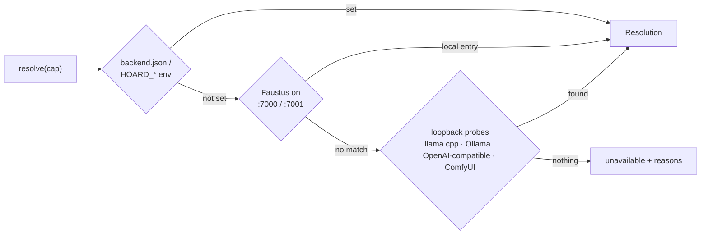

# Hoard Link

### One shared answer to "which model server do I use right now?"

**The shared model backend for agent-controlled apps: pick the
already-loaded local server for a capability instead of loading a second
copy of a model.**

[Español](README.es.md) · [Quick start](#quick-start) ·
[Hoard Hub](#hoard-hub-the-desktop-launcher) · [Use with Faustus](#use-with-faustus) · [API](#api) ·
[Portfolio](https://luissalet.github.io/Portfolio/#projects)

Hoard Link is a small Python library — standard library plus `httpx`, no
server, no port, no UI — that a set of local apps can each vendor a copy
of to answer one question: **for capability X (`llm`, `vision`,
`embeddings`, `tts`, `stt`, `image`, `video`, `music`), which server and
which model do I use right now, and why?** — and then to actually call it.

## Why sharing matters on a GPU-bound machine

On a machine running **Faustus** (a local AI workspace) plus several
plugin apps, the GPU is the scarce resource. A realistic setup is one
`llama-server` (llama.cpp) serving a 27B model that by itself fills most
of a large GPU, sometimes with Ollama and ComfyUI alongside it. If every app that wants
an LLM call loaded its *own* model, the machine would run out of VRAM
after the second app started. Hoard Link's job is to make every app ask
"is someone already serving what I need?" before it ever asks a server to
load anything, and to never disturb whatever the human is doing with
Faustus at that moment.

Hoard Link does not run its own model server and does not manage
lifecycles. It resolves an address, and — for chat/embeddings/tts — makes
the HTTP call for you against the server it found.

## Quick start

Windows (PowerShell):

```powershell
git clone https://github.com/Luissalet/HoardLink.git
cd HoardLink
py -m venv .venv
.venv\Scripts\Activate.ps1
pip install -e ".[dev]"
python examples/status.py
```

Linux / macOS:

```bash
git clone https://github.com/Luissalet/HoardLink.git
cd HoardLink
python3 -m venv .venv
. .venv/bin/activate
pip install -e ".[dev]"
python examples/status.py
```

`examples/status.py` prints one line per capability: what resolved and
why, or why nothing did. On a machine with no model server running, every
line reads `unavailable` followed by the reasons, e.g.

```
hoard-link 0.1.1
       llm  unavailable  Faustus not reachable on configured/default ports; no llama.cpp server found on ports 8080-8090; Ollama not reachable on 11434; no OpenAI-compatible server found on 1234
```

Start `llama-server`, Ollama or ComfyUI (or point `HOARD_LLM_URL` at a
server) and run it again to see that capability resolve. Pass a
`backend.json` path as the first argument to try your own configuration.

## Resolution order

For each capability, in order:



1. **Explicit configuration** — the app's own `backend.json` and
   `HOARD_<CAP>_URL` / `HOARD_<CAP>_MODEL` / `HOARD_FAUSTUS_URL` /
   `HOARD_FAUSTUS_TOKEN` / `HOARD_COMFY_URL` environment overrides. A
   capability with a `url` (or a `command`) wins outright and is not
   probed; a stale address surfaces as `BackendError` (status `0`: no
   HTTP response) the first time it's actually called. A `model` without
   a `url` is only a *preference*, applied wherever the later steps have
   a choice (Ollama resident models, the Faustus model list, an
   OpenAI-compatible server's model list).
2. **Faustus** — if a Faustus instance answers `GET /api/health` as
   healthy on `127.0.0.1:7000` or `:7001` (configurable), Hoard Link reads
   `GET /api/models` (with a bearer token when one is configured) for the
   model-server registry Faustus itself uses, and talks to that server
   **directly** — same server, same resident model, which is the actual
   sharing. Only local entries (category `local`, loopback URL) are used:
   a cloud endpoint in Faustus's registry is skipped so the app's data
   never leaves the machine. An Ollama entry is cross-checked against
   that Ollama's `/api/ps` before it is called resident. With no token
   configured the request is sent without one (a Faustus with auth
   disabled still answers); a 401 then says a token is needed. For `tts`/`stt` it also tries Faustus's own
   `/api/tts/*`/`/api/stt/*` endpoints; a 401/403 there is recorded as a
   reason (a browser-only session) and resolution moves on rather than
   failing.
3. **Shared servers on loopback**, probed in parallel with a 1s
   wall-clock timeout per request and cached for 30s (single-flight:
   concurrent resolutions share one probe; the probing client ignores
   `HTTP(S)_PROXY`): llama.cpp (`8080`–`8090`, via `/props`,
   `/v1/models`, `/slots`), Ollama (`11434`, via `/api/ps` for **resident**
   models, `/api/tags`, `/api/show` for capabilities), a generic
   OpenAI-compatible chat server on `1234` (`llm` only), and
   ComfyUI (`8188`, `image`/`video`). A port only counts as a
   llama-server if its `/props` carries llama-server keys. No probe ever
   raises, whatever JSON a port answers with.
4. **Nothing** — the capability comes back `unavailable`, with the list of
   reasons collected along the way (why Faustus didn't answer, why no
   loopback server matched, etc.) so an app's Settings screen can show a
   human exactly what to fix.

## Policies

- **`only_resident = True` by default.** Hoard Link picks models that are
  already loaded — Ollama's `/api/ps`, or a llama-server, which always
  serves exactly the one model it was started with. It will not ask a
  server to load a different model unless the app's config sets
  `allow_load: true` for that capability (or `only_resident: false`
  globally), and it never sends `keep_alive`. A model that would load is
  still checked (`/api/show`) for the capability asked for, and an
  embedding-only model is never picked for `llm`.
- **Yield to the foreground.** `await link.wait_idle("llm", max_wait_s=30)`
  is `True` immediately when the resolved llama-server has no slot
  `is_processing`, otherwise it polls every 2s until it does or
  `max_wait_s` elapses (then `False`, and the caller decides to postpone
  its background job). This works whether the llama-server came from
  probing, the Faustus registry or explicit config (`provider:
  "llamacpp"`). Ollama exposes no busy signal, so `wait_idle` always
  returns `True` for it — documented here rather than guessed at.
- **GPU jobs know free VRAM first.** `gpu_free_mb()` shells out to
  `nvidia-smi --query-gpu=index,memory.total,memory.used
  --format=csv,noheader,nounits` (best effort — no NVIDIA GPU or no
  `nvidia-smi` on PATH just yields `[]`; on Windows it runs with
  `CREATE_NO_WINDOW` and also looks in the legacy `NVSMI` folder).
  `resolve("image")` runs it in a worker thread and reports the GPU with
  the most free memory plus a per-GPU list. `ComfyClient` never calls
  `/free` on its own; only when the caller asks for it.
- **Every resolution explains itself.** `Resolution.reason` is a sentence
  fit for a Settings screen, e.g. `"llm -> llama.cpp at 127.0.0.1:8081
  (qwen3.8-27b-q8-llamacpp), from Faustus registry; resident"`.

## Installing (vendoring)

Hoard Link is meant to be **copied**, not installed as a third-party
dependency, so each app ships one committed copy of the exact behaviour
its tests were written against. Copy the whole `hoard_link/` directory
(every `.py` file, no `__pycache__/`) into your package, never edit the
copy, and to update, replace the directory wholesale. Record where the
copy came from in a `VENDORED.txt` next to it:

```
<app_pkg>/
  hoard_link/        <- copy of this repo's hoard_link/ directory
    VENDORED.txt     <- "Vendored from HoardLink (https://github.com/Luissalet/HoardLink), version 0.1.1"
  ...
```

Every app that vendors the same version carries a byte-identical copy, so
a fix lands everywhere by re-copying one release.

```python
from .hoard_link import Link, LinkConfig
```

If your app already manages its own dependencies with `httpx` present,
that's the only third-party requirement. Python 3.11+, stdlib +
`httpx>=0.27,<1.0`, no platform-specific code — it runs the same on
Windows and Linux.

## `backend.json` schema

Every key is optional; everything not set falls through to Faustus, then
loopback probing.

```json
{
  "only_resident": true,
  "faustus": {"url": "http://127.0.0.1:7000", "token": "ody_..."},
  "comfy": {"url": "http://127.0.0.1:8188"},
  "capabilities": {
    "llm": {
      "url": "http://127.0.0.1:8081/v1/chat/completions",
      "model": "qwen3.8-27b-q8-llamacpp",
      "api": "openai",
      "provider": "llamacpp",
      "allow_load": false,
      "vram_mb": 20000
    },
    "tts": {"command": ["piper", "--model", "es_ES.onnx", "--output_file", "{out}"]}
  },
  "gpu_lease": {"enabled": true, "hub_url": "http://127.0.0.1:8810", "timeout_s": 300, "vram_mb": 8192}
}
```

Environment overrides (highest priority, layered on top of the file):
`HOARD_<CAP>_URL`, `HOARD_<CAP>_MODEL` (e.g. `HOARD_LLM_URL`,
`HOARD_VISION_MODEL`), `HOARD_FAUSTUS_URL`, `HOARD_FAUSTUS_TOKEN`,
`HOARD_COMFY_URL`, `HOARD_GPU_LEASE=0` (no GPU leases),
`HOARD_HUB_URL` (where the hub is). An empty variable counts as unset.

- `gpu_lease` and `vram_mb` only matter when a call would make a server
  **load** a model (`allow_load`, or `only_resident: false`): see
  [GPU memory leases](#gpu-memory-leases). `vram_mb` on a capability is
  what a load of its model needs; without it the size of the Ollama model
  file plus 20% and 512 MiB is used, else `gpu_lease.vram_mb`.

- `url` may be a server root (`http://127.0.0.1:8081`), a `/v1` base or a
  full endpoint; chat and embeddings each append the path they need. A
  URL under `/api/` implies `"api": "ollama"`, otherwise `"openai"`.
- `command` is a list of strings. `{text}`, `{voice}` and `{out}` are
  replaced literally; without `{text}` the text is written to the
  command's stdin (how Piper reads it), without `{out}` the audio is read
  from stdout. It runs without a console window, with a 120 s timeout.
- The file is read as UTF-8 with or without a BOM (Notepad's default).

## Hoard Hub: the desktop launcher


The repository also ships **Hoard Hub** (`hoard_link.hub`), the other
half of the same idea: the library answers *which model server do I use*,
the hub answers *which of my apps are up, and open that one* — without
any AI workspace in the loop. It is a small loopback server with a card
per app and its own desktop window.

Every app in the family carries a `faustus-plugin.json` in its repository
root (id, name, purpose, URL, health check, launch hint). The hub reads
those manifests straight from the folders next to this repository (or any
roots you configure) — nothing new to write — and for each app shows:

* its **icon**, name, purpose, port, and **state**: running (health check
  answered with the expected `service`), starting (a listener, no healthy
  answer yet), stopped, or *port busy* (something else answers there; the
  hub will never stop that process);
* the **process** behind the port: pid, executable, memory, uptime,
  children (psutil);
* actions: **Open window** (the app's UI as its own desktop window — a
  Chromium `--app` window with a per-app profile, so it has its own
  taskbar entry and can be found and closed again), **Browser**,
  **Start** (the manifest's launch hint, detached, output to
  `data/logs/<id>.log`), **Stop** (the process tree, only when the
  health check says the listener really is that app), **Restart**,
  **Close windows**, **Folder**, **Log**;
* at the top, whether Faustus is reachable and what Hoard Link resolves
  right now for every capability, plus free VRAM per GPU;
* **profile** chips to start or stop a named set of apps at once (see
  [Profiles](#profiles));
* a **GPU** panel: per GPU used / reserved / available, and the
  [GPU memory leases](#gpu-memory-leases) granted and queued, each with a
  Release button.

Closing the hub's window stops the hub; the apps it started keep running,
on purpose — it is a remote control, not a parent.

```powershell
pip install psutil            # pids, memory, process-tree stops
python -m hoard_link.hub      # server on 127.0.0.1:8810 + desktop window
python -m hoard_link.hub --no-window   # server only (for an agent)
```

On Windows, double-click `Hoard Hub.cmd`. Configuration lives in
`data/hub.json` (`roots`, `icon_dirs`, `browser`, `faustus_dir`,
`faustus_python`, `window_size`, `exit_with_window`, `language`,
`profiles`, `lease_headroom_mb`) or the
`HOARD_HUB_*` environment variables; `pip install "hoard-link[desktop]"`
adds pywebview for a native hub window.

### Profiles

A profile is a named set of apps to start together — optionally with
external commands (a ComfyUI instance per GPU, a llama-server, a script)
and the apps to open as desktop windows — declared in `data/hub.json`:

```json
{
  "profiles": {
    "writing": {"apps": ["borges", "scribe"], "desktop": ["hypatia"]},
    "video": {
      "apps": ["daguerre"],
      "commands": [
        {"name": "comfy gpu1", "cmd": "python main.py --port 8189", "cwd": "D:/ComfyUI",
         "health": "http://127.0.0.1:8189/system_stats", "env": {"CUDA_VISIBLE_DEVICES": "1"}}
      ],
      "desktop": ["daguerre"]
    }
  }
}
```

The main screen shows one chip per profile (running count, start ▶,
stop ■). Commands get the same running/down treatment as apps: their
`health` URL when given, else whether the process the hub started is
alive; their output goes to `data/logs/cmd-<profile>--<name>.log`, and the
hub only ever stops a command it started itself. No profile is defined by
default; [docs/HUB.md](docs/HUB.md#profiles) has two complete examples.
HTTP: `GET /api/profiles`, `GET /api/profiles/<name>`,
`POST /api/profiles/<name>/start|stop`.

### GPU memory leases

Several programs want the same GPUs at once: a llama-server holding a big
model across GPUs, Ollama loading another, a few ComfyUI instances
rendering video, speech-to-text in one app, an image embedder in another.
When each of them looks at `nvidia-smi` on its own, two can see the same
free gigabytes at the same moment, both load, and one runs out of memory.
The hub is the one long-lived local process every app can reach, so it
keeps a single queue for the machine:

```python
from hoard_link import lease

with lease(vram_mb=6000, purpose="whisper large-v3", owner="scribe") as l:
    model = load_model(device=f"cuda:{l.gpu}" if l.gpu is not None else "cuda")
    ...                        # renewed in the background, released on exit

async with lease(vram_mb=20000, purpose="video render", owner="daguerre", priority=1, timeout_s=600) as l:
    ...
```

* A request is **granted** when `vram_mb` fits on a GPU (the one asked
  for, or the one with most room), counting both what `nvidia-smi`
  reports and what the hub already promised to others; otherwise it is
  **queued** — higher `priority` first, then first come first served. A
  queued request that does not fit holds back later ones for the same
  GPU, so a big render is not starved by a stream of small loads.
* Per GPU: `available = total - max(used, base + reserved) - headroom`,
  where `reserved` is the sum of granted leases and `base` is what the GPU
  used the last time it had no lease. Two reservations are never
  double-booked before their models load, and a loaded model is not
  counted twice (then `used` already includes it). `lease_headroom_mb` in
  `hub.json` (default 256) stays free on every GPU.
* A lease lives `ttl_s` (default 1800 s) and the client renews it while it
  is held. A lease that is not renewed expires, and one whose owner
  process died (`pid`, checked with psutil) is reaped, so a crashed app
  never blocks the queue. A queued request that is not polled for 90 s
  leaves the queue. Leases are kept in `data/leases.json` across hub
  restarts.
* Entering waits for the grant; `timeout_s` bounds the wait and raises
  `LeaseTimeout` (the queued request is withdrawn). A request larger than
  any eligible GPU raises `LeaseError`.
* **Without a hub nothing breaks.** When no hub answers and none can be
  started (the same headless start the MCP bridge uses; off with
  `HOARD_HUB_AUTOSTART=0`), the lease falls back to the old local check:
  it reads `gpu_free_mb()`, picks a GPU with room when there is one, logs a
  warning and lets the app proceed. `l.via` is `"hub"` or `"local"`.
* The client finds the hub through `hub_url=`, `HOARD_HUB_URL`, the `url`
  file in `HOARD_HUB_DATA_DIR` or in the HoardLink checkout's `data/`
  (a copy vendored into an app looks for a sibling `HoardLink` folder),
  then `http://127.0.0.1:8810`.
* `Link.chat()` and `Link.embed()` take a lease by themselves when the call
  would make the server **load** a model (a resident model needs none),
  release it afterwards, and turn a queue wait longer than
  `gpu_lease.timeout_s` into `Unavailable`. A request the hub rejects
  outright (e.g. an estimate larger than one GPU, for a model Ollama would
  split across several) loads without a lease.
* No NVIDIA GPU (no `nvidia-smi`): leases are granted without a memory
  check, so the same code runs everywhere.

HTTP (loopback, no token, same cross-site guard as the UI):
`POST /api/lease/request` `{owner, purpose, vram_mb, gpu, priority, ttl_s, wait, pid}`
→ `{lease_id, state, gpu, expires_at, position}` (`wait: true` long-polls
up to 25 s; send `{lease_id, wait: true}` to keep waiting on the same
place in the queue), `POST /api/lease/renew` `{lease_id, ttl_s}`,
`POST /api/lease/release` `{lease_id}`, `GET /api/lease` (GPUs with
used/free/reserved/available, the leases and the queue),
`GET /api/lease/<id>`. The hub window has a **GPU** panel with the same
picture and a Release button per lease.

### Driving the hub from an agent

The hub speaks the same contract as the apps it manages:
`GET /api/agent/tools` and `POST /api/agent/call` with the bearer token
from `data/mcp-token`, and a stdio MCP bridge
(`python -m hoard_link.hub.mcp`) that proxies to it and starts a headless
hub when none is listening. Tools: `hub_list_apps`, `hub_app_status`,
`hub_start_app`, `hub_stop_app`, `hub_restart_app`, `hub_open_app`,
`hub_close_windows`, `hub_start_all`, `hub_stop_all`, `hub_backends`,
`hub_lease_status`, `hub_lease_request`, `hub_lease_release`,
`hub_profile_list`, `hub_profile_start`, `hub_profile_stop`,
`hub_rescan`. More in [docs/HUB.md](docs/HUB.md). The repository's own `faustus-plugin.json` lets Faustus
adopt the hub like any other app.

## Use with Faustus

Nothing to configure when Faustus runs on the same machine with auth
disabled: Hoard Link finds it on `127.0.0.1:7000` or `:7001`, reads its
model registry and talks to the same local servers Faustus already has
loaded (see [Resolution order](#resolution-order), step 2). Point
`faustus.url` in `backend.json` (or `HOARD_FAUSTUS_URL`) at any other
port.

When Faustus requires auth, mint a token scoped to `chat` (the scope the model registry
and TTS/STT endpoints accept today) and put it in the app's
`backend.json` under `faustus.token`, or export it as
`HOARD_FAUSTUS_TOKEN` for the app's process. Faustus tokens look like
`ody_...`; treat them like any other local secret (keep them out of the
app's own git history — `backend.json` typically lives under the app's
gitignored `data/` directory).

## API

```python
import os
from hoard_link import Link, LinkConfig

link = Link(LinkConfig.load(path_to_backend_json, env=os.environ, app="argus"))

res = await link.resolve("vision")   # Resolution(capability, provider, url, model, api, state, reason, details)

status = await link.status()         # dict for GET /api/backend in the app: every capability's Resolution

text = await link.chat(
    [{"role": "user", "content": "..."}],
    images=[jpeg_bytes],
    max_tokens=300,
    temperature=0.2,
    capability="vision",
    response_format=None,
)                                     # -> ChatResult(text, model, provider, usage, elapsed_ms, reasoning)

vecs = await link.embed(["a", "b"])  # when an embeddings server resolves; else raises Unavailable

wav = await link.tts("Hola", voice=None)   # Faustus TTS or a configured command; else Unavailable

comfy = await link.comfy()           # ComfyClient, or None if nothing resolves

idle = await link.wait_idle("llm", max_wait_s=30)   # True/False, see Policies above

link.sync.chat(...)                  # same calls, blocking, for synchronous app code

from hoard_link import lease, Lease, LeaseTimeout, LeaseError
with lease(vram_mb=6000, purpose="whisper", owner="scribe", gpu=None, priority=0,
           timeout_s=None, hub_url=None) as l:   # also `async with`
    l.gpu, l.via, l.lease_id          # GPU index (or None), "hub" | "local", id on the hub
```

- `api` is `"openai"` (`/v1/chat/completions`, images as `image_url` data
  URLs on the last user message) or `"ollama"` (`/api/chat`, `images:
  [base64]` on the last user message, `stream: false`).
- Reasoning is kept out of `ChatResult.text` and exposed as
  `ChatResult.reasoning`: closed `<think>...</think>` blocks, an orphan
  `</think>` (the chat template opened the tag in the prompt), an
  unterminated `<think>` (cut off by `max_tokens`), and out-of-band
  fields (`reasoning_content` from llama-server, Ollama's `thinking`).
- `response_format` is passed through on the OpenAI dialect and mapped to
  Ollama's `format` (`json_object` -> `"json"`, `json_schema` -> the
  schema). Images get their real MIME type (JPEG, PNG, GIF, WebP).
- `ComfyClient(url)`: `system_stats()`, `object_info(node=None)`,
  `upload_image(bytes, filename, overwrite=True)`,
  `queue(workflow: dict, client_id) -> prompt_id`,
  `wait(prompt_id, timeout_s, on_progress=None)`,
  `outputs(prompt_id) -> list[OutputFile]`, `download(output) -> bytes`,
  `interrupt()`, `free(unload_models=False, free_memory=False)`.
  `queue()` validates the **API format** (a dict of node id ->
  `{class_type, inputs}`) and raises a clear `ValueError` if handed the
  UI's `{"nodes": [...], "links": [...]}` export instead. HTTP errors
  raise `BackendError` with the response body (so `/prompt`'s
  `node_errors` reach the caller), and `wait()` raises `BackendError`
  when the job finished with an execution error.
- Errors: `Unavailable(capability, reasons)` when nothing resolved,
  `BackendError(provider, status, body_excerpt)` for any failed call to a
  resolved server: a non-2xx status, a reply that is not the expected
  JSON, or `status == 0` when there was no HTTP response at all.
- `link.sync.*` runs on a private event-loop thread with its own HTTP
  client, so an app can mix `await link.chat()` and `link.sync.chat()`
  on one `Link`. If you inject your own `httpx.AsyncClient`, it is shared
  as given; don't mix both styles on it. Calling `link.sync.*` from that
  private thread (e.g. inside a callback) raises `RuntimeError` instead
  of deadlocking.

## Boundaries (what this library does not do)

- **No music generation.** ComfyUI's `object_info` gives no reliable
  signal for audio/music graphs the way `CheckpointLoaderSimple` does for
  image checkpoints, so `music` only resolves through explicit
  configuration or a matching Faustus registry entry, never through
  loopback probing.
- **No websocket progress for ComfyUI.** `ComfyClient.wait()` polls
  `/history/{id}`; it does not open `/ws` for push progress. A poll every
  second is simple, correct and testable offline; a websocket client is a
  second thing to keep alive and reconnect, which isn't worth it for a
  job-completion wait.
- **`resolve()` does not verify explicit configuration.** Resolution-order
  source #1 is trusted as given; a stale `backend.json` entry surfaces as
  a `BackendError` with `status == 0` on the first real call rather than
  being probed ahead of time. This keeps explicit configuration doing exactly one
  thing (override everything else) instead of two.
- **The sync facade is one background thread per `Link`.** It is meant
  for an app whose own request handlers are synchronous; it is not a
  thread pool and does not parallelize calls to the same `Link`. Called
  from async code it blocks that thread until the result is ready, so
  prefer `await` there.
- **No TTS over HTTP URL.** `tts` works through Faustus's TTS service or
  a configured `command`; a `tts` capability with only a `url` resolves
  but `link.tts()` raises `Unavailable`.
- **No cloud endpoints.** Faustus registry entries that are not local
  are ignored on purpose.

## Tests

With the virtual environment from the [Quick start](#quick-start) active,
on Windows or Linux:

```
pytest -q
```

184 tests, offline (`httpx.MockTransport`), in about 10 seconds. The only
real sockets are in the sync-facade tests and the hub tests, which start
tiny HTTP servers on ephemeral `127.0.0.1` ports (a fake app answering
`/api/health`, and a launchable one the hub really starts and stops); the
TTS-command tests run the current Python interpreter as the "TTS binary". No test needs network access or a
downloaded model, so CI (`.github/workflows/ci.yml`: Ubuntu and Windows,
Python 3.11 to 3.13) runs the same suite with no GPU and no network.

## License

MIT — see [LICENSE](LICENSE).
